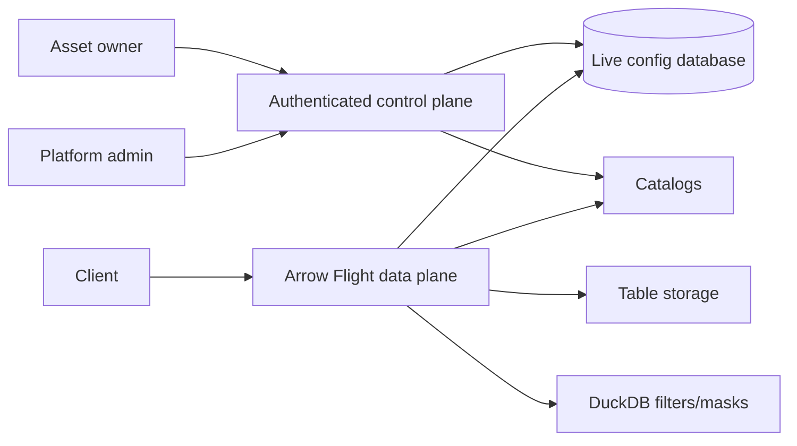

# dal-obscura

[](https://github.com/snithish/dal-obscura/actions/workflows/ci.yml)
[](https://github.com/snithish/dal-obscura/pkgs/container/dal-obscura)
[](https://github.com/snithish/dal-obscura/releases)
[](https://github.com/snithish/dal-obscura/blob/main/LICENSE)

Governed analytical data access layer for Arrow Flight reads. Owners edit asset
policies in the authenticated control plane, and data-plane workers enforce the
current catalog, row, column, and mask configuration on new reads. Issued
tickets retain the access they captured until expiry unless an asset owner
revokes them.

dal-obscura supports governed Iceberg assets, DuckDB row filters, column masks,
and JVM/Python connector surfaces.

**Production status:** the governance UI and administrative backend include the
normal authenticated workspace, OIDC/PKCE login, local bootstrap login for
development, direct policy authoring, catalog management, and consumer
instructions. Paid-production release remains on hold until the live
PostgreSQL, TLS/OIDC, artifact, browser, consumer, recovery, and independent
security gates pass. Use the [operator guide](docs/operators.md) and
[compatibility matrix](docs/compatibility.md) to assess deployment requirements
and tested client support. Local test results do not certify a production release.

## Contents

- [Why dal-obscura](#why-dal-obscura)
- [Fast start](#fast-start)
- [Documentation](#documentation)
- [Architecture](#architecture)
- [Runtime model](#runtime-model)
- [Connectors](#connectors)
- [Development](#development)
- [Status and limits](#status-and-limits)

## Why dal-obscura

- Governed reads through Arrow Flight plan/ticket flow.
- Direct, revision-checked policy changes for row filters, column grants, and masks.
- Multi-column mask editing with rule-local column and principal exemptions.
- Guided audience, column, mask, and row-filter authoring with editable mask
  cards, an AND/OR condition builder, and a live summary of local changes.
- Authenticated control-plane UI and API for assets, catalogs, owners, and policies.
- Stateless data-plane serving over canonical live configuration records.
- HMAC-signed, DB-backed tickets with explicit per-asset revocation.
- DuckDB execution for residual row filters and masking.
- Spark/JVM and Python connector entry points.

## Fast start

The local Keycloak demo assembles IAM, Postgres, control plane, Iceberg, Flight,
and the authenticated governance UI. It is a disposable development profile;
its HTTP Keycloak and demo credentials do not satisfy production acceptance:

```bash
cd examples/demo/keycloak
./demo init
./demo check
```

Open the Flight data plane at `grpc+tcp://localhost:28115`.

Open the governance UI at `http://localhost:28821`. Choose **Sign in with SSO**
and use the `demo-admin` password printed by `./demo credentials`. Browser bootstrap
login is disabled in this example. First initialization needs uv and a running
container engine with Compose v2; the full browser check also needs Node 24/pnpm.
Use `./demo up` for later starts and `./demo init` to rebuild after code changes.

For HTTPS Keycloak, browser HTTPS, Flight mTLS, and separate database roles,
use the [secure local demo](deployment/local-secure/README.md). It follows the
same init/up/check lifecycle and runs independently on separate loopback ports.

Stop the demo without deleting state:

```bash
./demo down
```

For package setup and command discovery from the repo root:

```bash
uv sync --dev --extra server --extra sqlite
uv run dal-obscura --help
uv run dal-obscura-control-plane --help
uv run dal-obscura-migrate --help
```

## Documentation

Start with [docs/README.md](docs/README.md). It groups docs by user need.

| Need | Read |
| --- | --- |
| Try the service | [Quickstart](docs/quickstart.md) |
| Understand the model | [Concepts](docs/concepts.md) |
| Author policies | [Policy Authoring](docs/policy-authoring.md) |
| Run the service | [Operators](docs/operators.md) and [Operator Runbook](docs/operators-runbook.md) |
| Review risk | [Security](docs/security.md) |
| Integrate clients | [Connectors](docs/connectors.md) and [connectors/README.md](connectors/README.md) |
| Contribute | [Development](docs/development.md) |

## Architecture

Explore the [interactive architecture atlas](docs/architecture/architecture-atlas.html)
for C4 levels 1–4, planning/fetch sequences, and the governed Arrow data flow.
[Editable Mermaid diagrams](docs/architecture/architecture-atlas.md) are included.



Schema discovery and read planning bind catalog, asset, policy, and schema admission
from one database snapshot per request. No deployment-wide generation counter or
policy cache is used. Provider IO starts after the database session closes. See
[live configuration](docs/live-configuration.md) for consistency,
provider lifecycle, and startup-setting restart semantics.

Each asset has one live policy guarded by an optimistic revision. Saving writes
it directly to the shared config database. Issued tickets keep their captured
permissions until expiry; an owner can revoke all active asset tickets at any
time or select revocation as part of a policy save.

Key paths:

| Path | Purpose |
| --- | --- |
| `src/dal_obscura/control_plane` | Authenticated API, live configuration use cases, and repositories. |
| `src/dal_obscura/data_plane` | Arrow Flight service, planning, fetching, auth, transforms. |
| `src/dal_obscura/common` | Shared policy, catalog, table-format, ticket, and config-store code. |
| `connectors` | JVM client, Spark datasource, testkit, and contract fixtures. |
| `examples` | Auth examples, local demo, and sample data. |
| `tests` | Unit, integration, smoke, and benchmark tests. |

## Runtime model

Run schema migrations explicitly before starting services:

```bash
uv run dal-obscura-migrate upgrade
uv run dal-obscura-migrate check
```

Start the authenticated control plane after applying migrations:

```bash
export DAL_OBSCURA_DATABASE_URL=sqlite+pysqlite:///runtime/control-plane.db
export DAL_OBSCURA_CONTROL_PLANE_ADMIN_TOKEN=replace-with-a-local-admin-token
uv run dal-obscura-control-plane
```

Start a data plane against the same config database:

```bash
export DAL_OBSCURA_DATABASE_URL=sqlite+pysqlite:///runtime/control-plane.db
export DAL_OBSCURA_LOCATION=grpc://127.0.0.1:8815
export DAL_OBSCURA_TICKET_SECRET=replace-with-a-secret
uv run dal-obscura
```

Manage assets and policies through the authenticated governance UI or control
plane API. Policy updates validate and take effect for new reads immediately.
The policy editor applies mask changes locally to explicit columns, then saves
the complete policy atomically against its revision. Matching rule filters
combine with AND; exemptions skip only the specified rule's mask and never
bypass row restrictions or masks from another rule. Policy tests evaluate the
saved policy version.
The searchable column picker previews bulk selections, multiple exclusions, and
prefix matches. A collapsible schema reference keeps nested paths and types
nearby, and a sticky rules toolbar keeps one **New rule** action within reach. See the
[UI before/after review](docs/ui-review/review.html) for screenshots and rationale.
Identity settings map trusted provider claims to named policy attributes with
optional enforced allowed values. Policy conditions offer searchable attributes
and value chips; provider-mode tests use the runtime mapper and show missing or
mismatched claims. See [identity attribute authoring](docs/policy-authoring.md#identity-attributes).
To invalidate existing tickets, revoke them from the asset's Access view or
choose **Revoke existing tokens after saving** in the policy editor.

The published container image is `ghcr.io/snithish/dal-obscura`. The same image
can run migration, operator, and data-plane commands. See
[docs/operators.md](docs/operators.md) for production-oriented setup.

## Connectors

Connector implementations live under `connectors/`.

- `jvm/dal-obscura-client-java`: engine-agnostic Java Flight client.
- `jvm/spark3-datasource`: Spark 3.x DataSource V2 reader.
- `jvm/connector-testkit-jvm`: shared JVM integration helpers.
- `contract-fixtures`: language-neutral protocol fixtures.

Build and verify the JVM connector workspace:

```bash
mvn -f connectors/jvm/pom.xml verify
```

## Development

See [the testing guide](docs/testing.md) for suite ownership and verification lanes,
[development](docs/development.md) for development checks, and
[read execution invariants](docs/read-execution-invariants.md) for correctness boundaries.

```bash
uv sync --dev --extra server --extra sqlite
uv run ruff check .
uv run ruff format .
uv run ty check
uv run pytest
```

JVM connector checks:

```bash
mvn -f connectors/jvm/pom.xml verify
```

Benchmark suites are available under `tests/benchmarks`; use JSON output as the
before/after artifact for planner, masking, filtering, and table-format changes.

## Status and limits

Each configuration database represents one deployment. Catalog names are globally
unique, assets are keyed by catalog and target, and runtime settings are shared by
all connected data-plane processes. There are no cell or tenant routing IDs.
The baseline schema is `20260930_0001`, with nested schema type storage upgraded
in `20260930_0002`. Run `dal-obscura-migrate upgrade` before starting services.
Database schemas and stored tickets from before this baseline are unsupported.

The [read execution invariants](docs/read-execution-invariants.md) map correctness
requirements to tests and document streaming, planning, and scaling limits.

- Row filters and masks are DuckDB SQL expressions.
- Catalogs resolve governed targets into executable table formats.
- Standalone path reads are not a public discovery path.
- Iceberg pushdown is conservative; residual filtering is reapplied in DuckDB.
- ABAC conditions currently support exact principal-attribute matches and
  explicit allowed-value lists.
- Tickets persist trusted internal Python scan tasks server-side, so the DB
  ticket payload format is tied to Python internals.

### NULL-default policy authoring

All requested columns start NULL-masked. Named, collapsible rules reveal selected
columns or apply explicit masks; row filters combine independently with AND.
The editor provides optional mask/filter controls, nested-column shortcuts,
whole-policy discard, and a shared saved-policy test modal. An explicit **Allow
all to all users** rule bypasses masks and row filters for authenticated readers.
See [policy authoring](docs/policy-authoring.md) for conflict and exemption rules.

This is a breaking development cutover. Recreate disposable configuration
databases, then run `uv run dal-obscura-migrate upgrade` to install the current
bootstrap schema, including rule names and descriptions. Old policy, field-path,
and ticket shapes are not supported. Ungranted columns return NULL.

Compatibility policy: development contracts have a single supported shape.
Use explicit `$element`, `$key`, and `$value` field-path segments, admitted plugin
descriptors, and complete stored ticket scan context. Signed transport tickets
contain only a ticket ID, expiry, and nonce. Removed URL tabs, field-name aliases,
missing ticket fields, and older database revisions are not adapted at runtime.
Native Iceberg and public plugins retain their IO validation and lifecycle checks.

### Streaming memory budgets

Governed reads admit a stream before reading its first Arrow batch. Each admitted
stream reuses one DuckDB connection, but executes each input batch separately.
Masks and supported row filters are row-local, so this preserves their results
while preventing DuckDB from buffering an entire input reader before returning
output. Output batches contain at most 8,192 rows. Tiny input batches incur more
query setup overhead; configure source batch sizes within the input byte budget.
Iceberg scanning consumes one file lazily per ticket, including that file's deletes,
while independent tickets preserve parallelism. This deliberately uses PyIceberg's
native internal scan iterator because its public iterator materializes whole files;
run native-scan conformance tests when upgrading PyIceberg. Delete-file decoding and
Parquet read-ahead still require additional memory. Large Parquet row groups can
retain oversized buffers and be rejected; write suitably sized row groups rather
than relying on small output slices to reduce their retained memory.

- `DAL_OBSCURA_MAX_CACHED_CATALOG_PROVIDERS` defaults to `32` per process. Providers
  are reused across assets by catalog connection configuration, with idle LRU
  eviction and leases protecting active planners.
- `DAL_OBSCURA_CATALOG_PROVIDER_WAIT_SECONDS` defaults to `5`. When every provider
  slot is occupied, planning waits up to this timeout, then returns Flight
  `UNAVAILABLE`; it does not create an unbounded number of providers.
- `DAL_OBSCURA_MAX_ACTIVE_STREAMS` defaults to `16`; excess reads fail immediately.
- `DAL_OBSCURA_DUCKDB_MEMORY_LIMIT` defaults to `512MB` per connection. Supply an
  explicit positive byte size, such as `256MB` or `1GiB`; unlimited and percentage
  values are rejected at startup.
- `DAL_OBSCURA_MAX_INPUT_BATCH_BYTES` and `DAL_OBSCURA_MAX_OUTPUT_BATCH_BYTES`
  default to 64 MiB each. Both logical size and retained Arrow buffers are checked;
  a small slice retaining a large parent buffer can exceed the limit.

Capacity, batch-budget, and allocation failures surface as Flight `UNAVAILABLE`.
A failure can occur after partial output: callers must discard partial results
before retrying the read. Oversized batches are rejected rather than truncated.
Connections, readers, and admission slots are released on completion, failure, or
stream cancellation.

These are per-stream guardrails, not a hard process RSS cap. DuckDB's memory limit
covers its buffer manager, while Arrow, source plugins, and transport buffers also
allocate memory. Source batches are allocated before their size can be checked.
Size concurrency and budgets together, leave headroom, and use an OS/container
memory limit for a hard ceiling. See [DuckDB's memory-limit scope](https://duckdb.org/docs/current/operations_manual/limits).

Memory regression tests sample child-process RSS externally every 5 ms, including
work before the first output, with fixture setup excluded by a synchronization
barrier. They compare numeric and wide-row streams at different total sizes and
exercise the full Iceberg/Flight path. Sampling can miss shorter spikes; it is a
regression signal, not proof of a hard upper bound. The end-to-end probe includes
both the client and server in the measured process.
