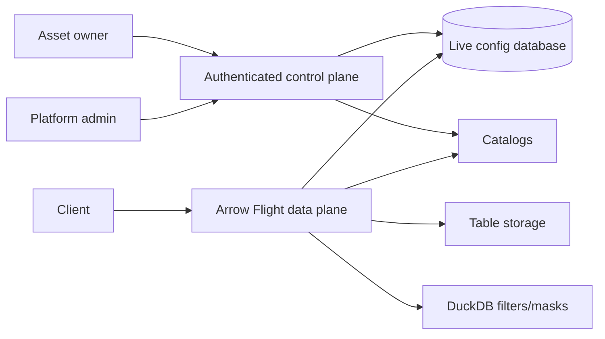

# dal-obscura

[](https://github.com/snithish/dal-obscura/actions/workflows/ci.yml)
[](https://github.com/snithish/dal-obscura/pkgs/container/dal-obscura)
[](https://github.com/snithish/dal-obscura/releases)
[](https://github.com/snithish/dal-obscura/blob/main/LICENSE)

Governed analytical data access layer for Arrow Flight reads. Owners edit asset
policies in the authenticated control plane, and data-plane workers enforce the
current catalog, row, column, and mask configuration on new reads. Issued
tickets retain the access they captured until expiry unless an asset owner
revokes them.

dal-obscura supports governed Iceberg assets, DuckDB row filters, column masks,
and JVM/Python connector surfaces.

**Production status:** the governance UI and administrative backend include the
normal authenticated workspace, OIDC/PKCE login, local bootstrap login for
development, direct policy authoring, catalog management, and consumer
instructions. Paid-production release remains on hold until the live
PostgreSQL, TLS/OIDC, artifact, browser, consumer, recovery, and independent
security gates pass. See the [code-backed readiness review](docs/ui-v2/PRODUCTION_READINESS.md)
and [implementation ledger](docs/plugin-platform/STATUS.md) for the evidence.

## Contents

- [Why dal-obscura](#why-dal-obscura)
- [Fast start](#fast-start)
- [Documentation](#documentation)
- [Architecture](#architecture)
- [Runtime model](#runtime-model)
- [Connectors](#connectors)
- [Development](#development)
- [Status and limits](#status-and-limits)

## Why dal-obscura

- Governed reads through Arrow Flight plan/ticket flow.
- Direct, revision-checked policy changes for row filters, column grants, and masks.
- Authenticated control-plane UI and API for assets, catalogs, owners, and policies.
- Stateless data-plane serving over canonical live configuration records.
- HMAC-signed, DB-backed tickets with explicit per-asset revocation.
- DuckDB execution for residual row filters and masking.
- Spark/JVM and Python connector entry points.

## Fast start

The local Keycloak demo assembles IAM, Postgres, control plane, Iceberg, Flight,
and the authenticated governance UI behind Caddy HTTPS. It is a disposable
development profile; its local certificate authority and demo credentials do
not satisfy production acceptance:

```bash
cd examples/demo/keycloak
./run up
./run smoke
```

Open the Flight data plane at `grpc://127.0.0.1:8815`.

Open the governance UI at `https://governance.localhost`. Export and trust the
Caddy root certificate using the [demo instructions](examples/demo/keycloak/README.md#credentials)
first. The normal page starts signed out. Choose **Sign in with SSO** when the
demo OIDC settings are enabled, or use the local control-plane token form when the service is running with
`DAL_OBSCURA_CONTROL_PLANE_BOOTSTRAP_ENABLED=true`. The production profile
disables bootstrap and requires OIDC.

Stop the demo without deleting state:

```bash
./run down
```

For package setup and command discovery from the repo root:

```bash
uv sync --dev --extra server --extra sqlite
uv run dal-obscura --help
uv run dal-obscura-control-plane --help
uv run dal-obscura-migrate --help
```

## Documentation

Start with [docs/README.md](docs/README.md). It groups docs by user need.

| Need | Read |
| --- | --- |
| Try the service | [Quickstart](docs/quickstart.md) |
| Understand the model | [Concepts](docs/concepts.md) |
| Author policies | [Policy Authoring](docs/policy-authoring.md) |
| Run the service | [Operators](docs/operators.md) and [Operator Runbook](docs/operators-runbook.md) |
| Review risk | [Security](docs/security.md) |
| Integrate clients | [Connectors](docs/connectors.md) and [connectors/README.md](connectors/README.md) |
| Contribute | [Development](docs/development.md) |

## Architecture



Each asset has one live policy guarded by an optimistic revision. Saving writes
it directly to the shared config database. Issued tickets keep their captured
permissions until expiry; an owner can revoke all active asset tickets at any
time or select revocation as part of a policy save.

Key paths:

| Path | Purpose |
| --- | --- |
| `src/dal_obscura/control_plane` | Authenticated API, live configuration use cases, and repositories. |
| `src/dal_obscura/data_plane` | Arrow Flight service, planning, fetching, auth, transforms. |
| `src/dal_obscura/common` | Shared policy, catalog, table-format, ticket, and config-store code. |
| `connectors` | JVM client, Spark datasource, testkit, and contract fixtures. |
| `examples` | Auth examples, local demo, and sample data. |
| `tests` | Unit, integration, smoke, and benchmark tests. |

## Runtime model

Run schema migrations explicitly before starting services:

```bash
uv run dal-obscura-migrate upgrade
uv run dal-obscura-migrate check
```

Start the authenticated control plane after applying migrations:

```bash
export DAL_OBSCURA_DATABASE_URL=sqlite+pysqlite:///runtime/control-plane.db
export DAL_OBSCURA_CONTROL_PLANE_ADMIN_TOKEN=replace-with-a-local-admin-token
uv run dal-obscura-control-plane
```

Start a data plane against the same config database:

```bash
export DAL_OBSCURA_DATABASE_URL=sqlite+pysqlite:///runtime/control-plane.db
export DAL_OBSCURA_CELL_ID=00000000-0000-0000-0000-000000000001
export DAL_OBSCURA_LOCATION=grpc://127.0.0.1:8815
export DAL_OBSCURA_TICKET_SECRET=replace-with-a-secret
uv run dal-obscura
```

Manage assets and policies through the authenticated governance UI or control
plane API. Policy updates validate and take effect for new reads immediately.
To invalidate existing tickets, revoke them from the asset's Access view or
choose **Revoke existing tokens after saving** in the policy editor.

The published container image is `ghcr.io/snithish/dal-obscura`. The same image
can run migration, operator, and data-plane commands. See
[docs/operators.md](docs/operators.md) for production-oriented setup.

## Connectors

Connector implementations live under `connectors/`.

- `jvm/dal-obscura-client-java`: engine-agnostic Java Flight client.
- `jvm/spark3-datasource`: Spark 3.x DataSource V2 reader.
- `jvm/connector-testkit-jvm`: shared JVM integration helpers.
- `contract-fixtures`: language-neutral protocol fixtures.

Build and verify the JVM connector workspace:

```bash
mvn -f connectors/jvm/pom.xml verify
```

## Development

```bash
uv sync --dev --extra server --extra sqlite
uv run ruff check .
uv run ruff format .
uv run ty check
uv run pytest
```

JVM connector checks:

```bash
mvn -f connectors/jvm/pom.xml verify
```

Benchmark suites are available under `tests/benchmarks`; use JSON output as the
before/after artifact for planner, masking, filtering, and table-format changes.

## Status and limits

- Row filters and masks are DuckDB SQL expressions.
- Catalogs resolve governed targets into executable table formats.
- Standalone path reads are not a public discovery path.
- Iceberg pushdown is conservative; residual filtering is reapplied in DuckDB.
- ABAC conditions currently support exact principal-attribute matches and
  explicit allowed-value lists.
- Tickets persist trusted internal Python scan tasks server-side, so the DB
  ticket payload format is tied to Python internals.
