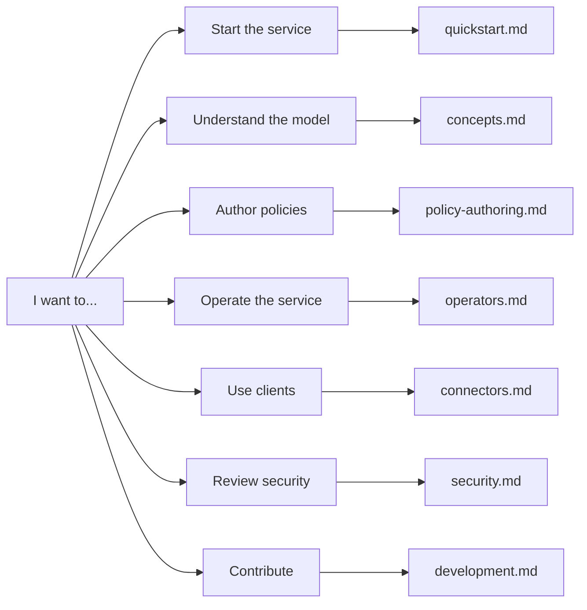
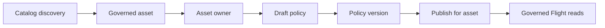

# dal-obscura Documentation

dal-obscura is a data access layer for governed analytical tables. It exposes
Arrow Flight reads, applies policy-based row filters and masks, and gives asset
owners a control-plane UI for managing policy versions.

Use this page as the map. Each guide is short and role focused.

## Recommended Reading

| Role | Start here | Then read |
| --- | --- | --- |
| Data consumer | [Quickstart](quickstart.md) | [Connectors](connectors.md) |
| Asset owner | [Concepts](concepts.md) | [Policy Authoring](policy-authoring.md) |
| Platform operator | [Operators](operators.md) | [Security](security.md) |
| Contributor | [Development](development.md) | [Frontend Conventions](frontend.md) |

## Core Guides

- [Quickstart](quickstart.md): start the service and verify the first governed
  read.
- [Concepts](concepts.md): catalogs, assets, owners, policies, publications, and
  data-plane reads.
- [Policy Authoring](policy-authoring.md): row filters, masks, owners, and
  policy-version publishing.
- [Operators](operators.md): production-oriented deployment, persistence, and
  runbooks.
- [Operator Runbook](operators-runbook.md): readiness, restart, reset, and
  triage checklist.
- [Security](security.md): IAM, tickets, secrets, and fail-closed behavior.
- [Connectors](connectors.md): Python, Spark/JVM, and Flight request contracts.
- [Development](development.md): repo layout, commands, tests, and release
  checks.
- [Frontend Conventions](frontend.md): React UI patterns and supply-chain policy.

## Mental Model

If you are new, start with the quickstart, then read the concepts guide.
