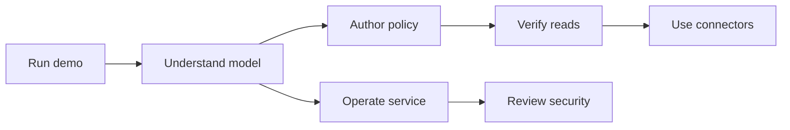
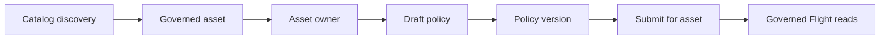

# dal-obscura Documentation

dal-obscura is a governed analytical data access layer. It exposes Arrow Flight
reads, applies policy-based row filters and masks, and gives asset owners a
control-plane UI for managing policy versions.

Use this page as the map. The docs are grouped by what you are trying to do.

## Contents

- [Start Here](#start-here)
- [Docs By Need](#docs-by-need)
- [Core Guides](#core-guides)
- [Mental Model](#mental-model)

## Start Here

| Reader | First read | Next read |
| --- | --- | --- |
| Evaluator | [Quickstart](quickstart.md) | [Concepts](concepts.md) |
| Data consumer | [Quickstart](quickstart.md) | [Connectors](connectors.md) |
| Asset owner | [Policy Authoring](policy-authoring.md) | [Concepts](concepts.md) |
| Platform operator | [Operators](operators.md) | [Operator Runbook](operators-runbook.md) |
| Security reviewer | [Security](security.md) | [Policy Authoring](policy-authoring.md) |
| Contributor | [Development](development.md) | [Frontend Conventions](frontend.md) |

## Docs By Need

### Try The Service

- [Quickstart](quickstart.md): run the local demo, verify the UI/API/Flight
  path, and learn the manual service shape.
- [Local Keycloak Demo](../examples/demo/keycloak/README.md): complete laptop
  environment with Keycloak, Postgres, Iceberg, Delta, UI, and Flight reads.

### Understand The Model

- [Concepts](concepts.md): catalogs, assets, owners, policy versions, tickets,
  and the control-plane/data-plane split.
- [Security](security.md): identity providers, ticket lifecycle, secret
  handling, and fail-closed behavior.

### Configure And Operate

- [Operators](operators.md): deployment shape, required decisions, startup
  order, health checks, and operational risks.
- [Operator Runbook](operators-runbook.md): readiness, restart, reset, and fast
  triage checklist.
- [Authentication Examples](../examples/auth/README.md): runnable Docker Compose
  fixtures for each built-in auth provider.

### Govern Data

- [Policy Authoring](policy-authoring.md): grant rules, row filters, masks,
  preview, and asset-scoped policy-version publishing.

### Integrate Clients

- [Connectors](connectors.md): client surfaces and read-path overview.
- [Connector Workspace](../connectors/README.md): JVM modules, Spark options,
  and protocol v1 details.

### Build And Contribute

- [Development](development.md): repo layout, common checks, test guidance, and
  release-oriented checklist.
- [Frontend Conventions](frontend.md): React stack, folder layout, API pattern,
  styling rules, and pnpm supply-chain policy.

## Core Guides

```mermaid
flowchart LR
    start["Run demo"] --> concepts["Understand model"]
    concepts --> policy["Author policy"]
    concepts --> ops["Operate service"]
    policy --> read["Verify reads"]
    ops --> security["Review security"]
    read --> connectors["Use connectors"]
```

Use the quickstart for a first working environment. Use the operator and
security guides before exposing a shared environment. Use connector docs only
after you have at least one governed asset and one allowed read persona.

## Mental Model

```mermaid
flowchart LR
    catalog["Catalog discovery"] --> asset["Governed asset"]
    asset --> owner["Asset owner"]
    owner --> policy["Draft policy"]
    policy --> version["Policy version"]
    version --> publish["Submit for asset"]
    publish --> read["Governed Flight reads"]
```

The public product model is asset-first. Internal runtime details such as
tenant and cell identifiers are kept out of normal user workflows.
