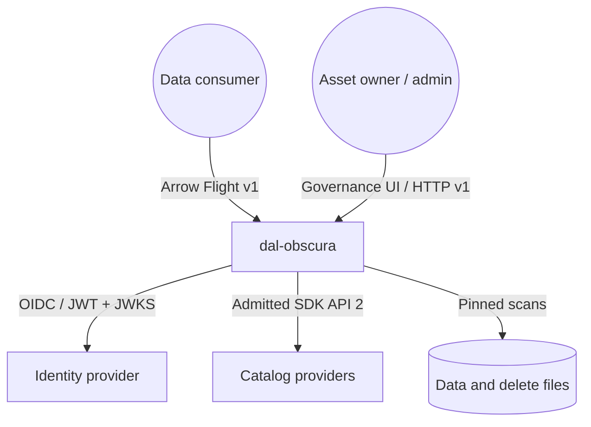
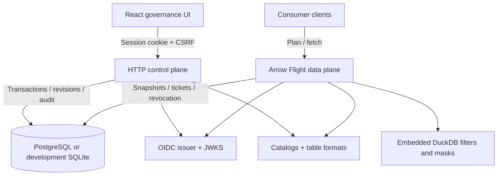
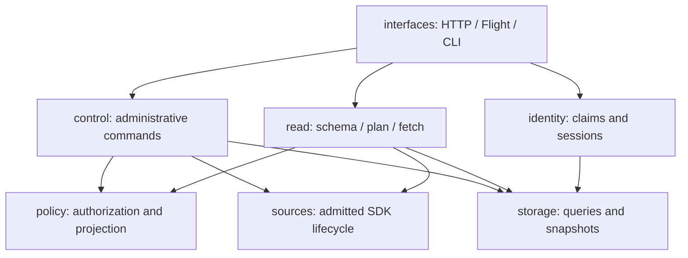
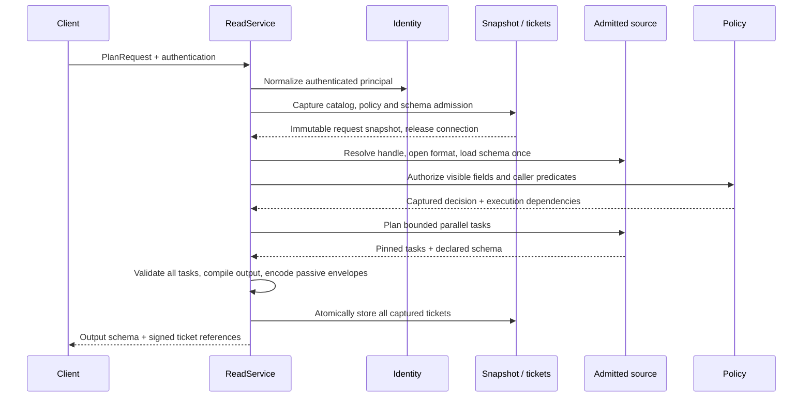
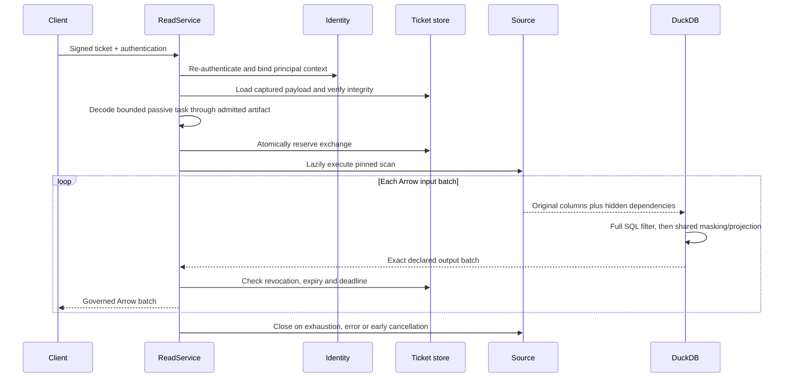

# Core 0.2 architecture and governed reads

Reviewed 2026-10-02. The interactive atlas includes zoom/pan and editable diagrams.
Six feature owners replace the old common/control_plane/data_plane layer trees.
Workers remain stateless apart from existing shared database records and bounded
provider caches. No tenant routing or global policy generation counter is added.

## System context

Python, DuckDB, Polars, Java and Spark 3 consume the same governed Flight contract.
The deployment owns TLS, runtime secrets, metadata egress policy and plugin locks.

## Deployment containers

Sessions, audit and ticket exchanges use the existing database. Provider IO starts
after the configuration snapshot transaction closes. Both planes use the same
admitted exact plugin artifacts and lock; DuckDB runs inside each data worker.

## Feature ownership

- **policy** owns immutable principal/rule/decision contracts, canonical typed
  field paths, filter ASTs, schema traversal and the SQL/output-schema compiler.
- **read** owns ReadService, ticket signing/integrity, exchange reservation,
  stream guards, cleanup and bounded DuckDB execution.
- **sources** owns provider leases, SDK catalogs/formats, bounded discovery,
  immutable handles, passive task envelopes and native Iceberg IO.
- **identity** owns JWT/JWKS/OIDC validation, claim normalization, session exchange
  and federated logout. Control attribute mapping/allowed values use these claims.
- **storage** owns feature-specific SQL queries, optimistic revisions, atomic
  snapshots, sessions, ticket exchange records and explicit migrations.
- **control** owns authorization-aware catalog/asset/policy/settings commands,
  schema admission, preview and publication. Routes supply transaction boundaries.
- **interfaces** maps transport requests/responses and composes the owners; Flight
  objects do not enter policy/read command contracts.

UI App coordinates commands. Navigation owns URL/leave guards; server-query hooks
own session-scoped assets and management data; the policy draft reducer owns edits,
baselines and save fences. HTTP shapes come from checked-in OpenAPI generation.

## Planning a read

Native SQL Iceberg and external catalogs use the same SDK lifecycle. Catalog
pagination reuses one bounded listing within its operation; later operations
refresh. Iceberg grouping balances estimated data plus delete bytes and preserves
every task exactly once. Literal dotted field/table names remain distinct.

## Fetching and streaming

SQL projection and output schema share one compiler, including NULL structs,
map keys, lists, ancestor masks and typed mask defaults. Schema normalization
reorders Arrow column references without copying matching buffers; casts occur
only when native types differ from declared types. ManagedStream closes once,
including unstarted streams, and preserves the primary error during cleanup.

## Trust and resource limits

Scan envelopes contain passive JSON, not pickle, module names or live callbacks.
They capture an admitted plugin identity, immutable handle, schemas, path roots and
bounded task payload. Schema encodings are checked before Arrow decoding; duplicate
JSON object keys and ambiguous Arrow field names are rejected. Filter pushdown
remains advisory; the complete restriction is enforced against original values.

Input/output byte limits, DuckDB memory budgets and stream admission are per
worker, not a global RSS cap. Deadline checks stop late output but cannot interrupt
all blocking backend IO. Planning memory grows with file count and delete buffers
are bounded by associated files, not a hard aggregate byte limit. Deployments must
measure concurrent readers, skew and delete density separately.

See [execution invariants](../read-execution-invariants.md),
[cutover runbook](../core-cutover.md), and [qualification report](core-rewrite-review.html).
