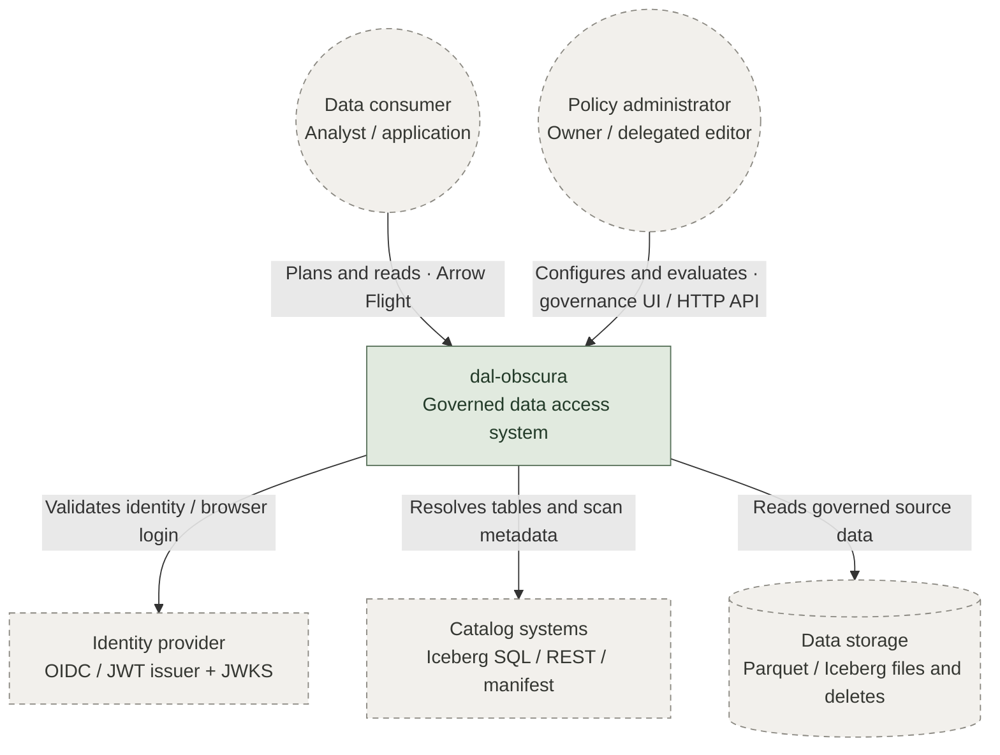
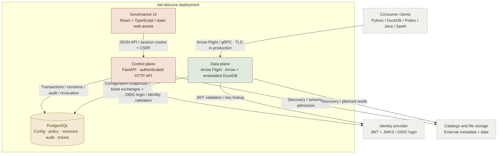
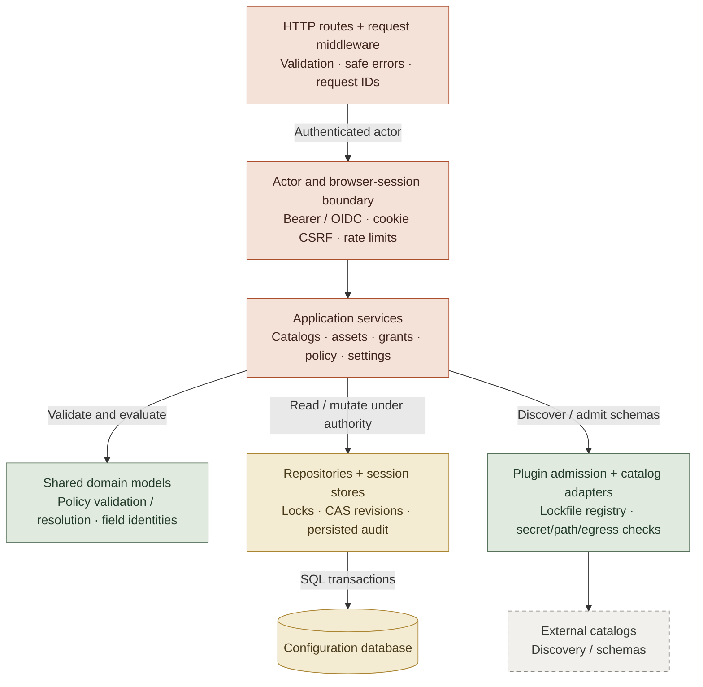
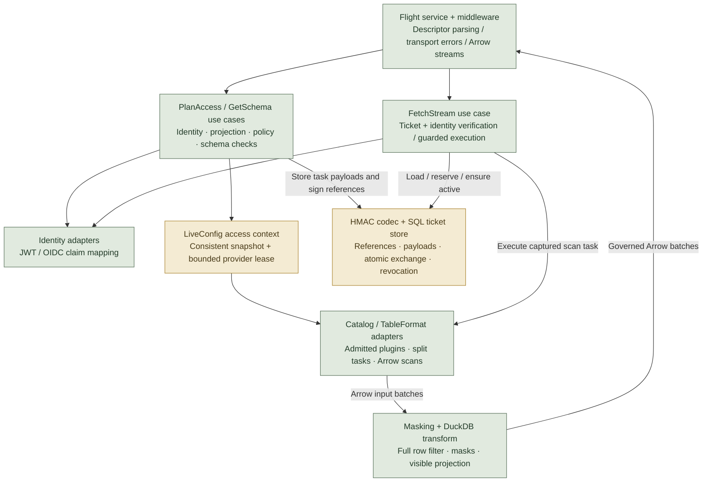
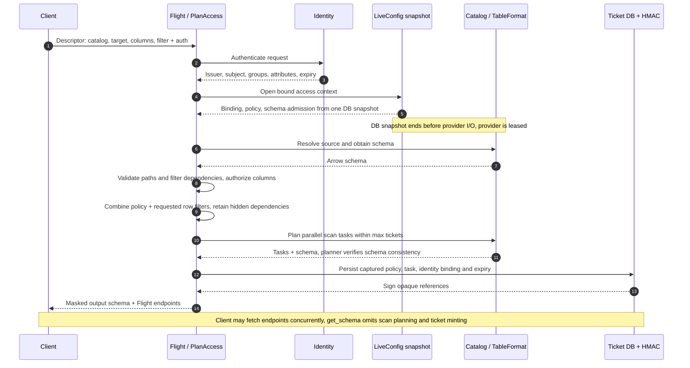
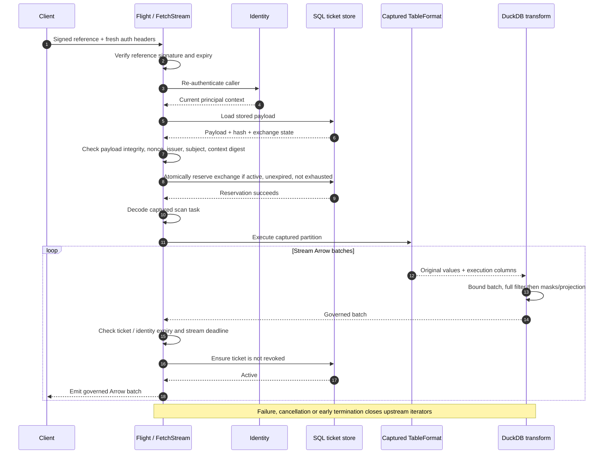
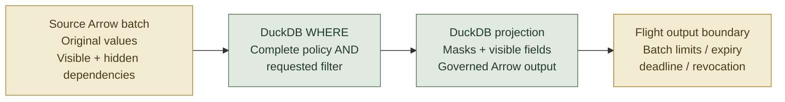
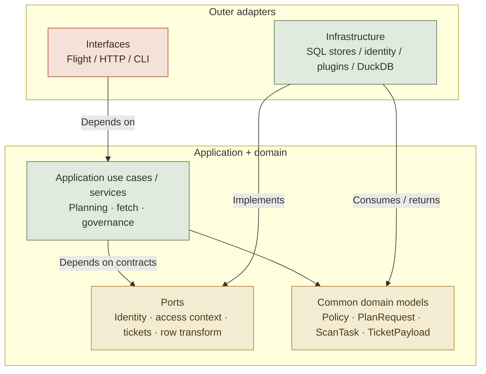
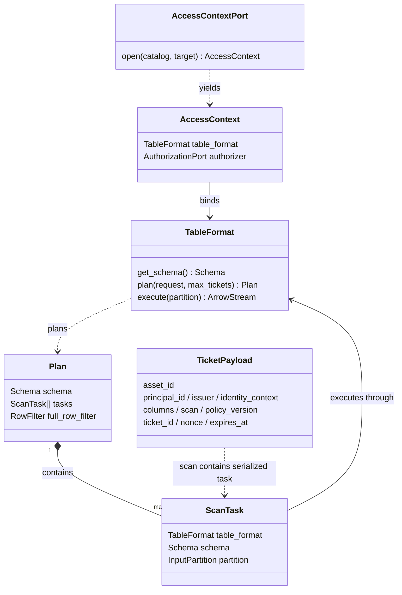

# dal-obscura architecture and request/data flow

Current implementation reviewed 2026-09-30. Open `architecture-atlas.html` for the
interactive atlas with zoom, pan, full-size expansion, and source references.

These diagrams describe the current implementation, not the proposed hardening work.
PostgreSQL owns durable configuration and tickets; workers have bounded ephemeral
provider caches. There is no tenant/cell routing or global generation counter.

## C4 · LEVEL 1 · SYSTEM CONTEXT: The governed access boundary

Who uses the product, and which external systems supply identity, metadata, and data?

The system boundary is one deployment. Tenant/cell routing and the global generation counter are absent. Per-resource revisions still protect writes and identify captured policy.

## C4 · LEVEL 2 · CONTAINERS: Separate governance from execution

Workers are replaceable. Durable configuration, sessions, audit, and ticket state live in the database.

DuckDB is embedded in each data-plane worker, not a separate service. SQLite is supported for development. HTTP edge/TLS termination depends on deployment configuration; the diagram shows logical relationships.

## C4 · LEVEL 3 · CONTROL-PLANE COMPONENTS: Control plane: change governed state

Capabilities, revision checks, transactions, and audit protect the administrative write path.

Policy evaluation uses synthetic rows through the same SQL masking/filter semantics. Saving policy changes affects future plans; explicit ticket revocation controls outstanding access.

## C4 · LEVEL 3 · DATA-PLANE COMPONENTS: Data plane: authorize, capture, execute

Application use cases depend on ports. Infrastructure adapters implement those ports.

Fetch does not resolve current policy again. Its execution instructions come from the stored ticket. Live configuration snapshots bind source configuration, schema admission, and policy before provider I/O.

## REQUEST FLOW · GET_FLIGHT_INFO: Request 1: plan access

One configuration snapshot becomes multiple bounded ticket endpoints. Source rows are not streamed during planning.

The database snapshot is request-local. Provider reuse is bounded and keyed by concrete configuration identity; it is not a policy cache or a generation system.

## REQUEST FLOW · DO_GET: Request 2: fetch governed data

Re-authentication, exchange reservation, and output guards protect each captured read.

Admission occurs once when the lazy transform starts; batch limits apply throughout. Deadline checks occur between yielded batches, not as hard interruption of every blocked provider/query operation.

## DATA FLOW · FILTER BEFORE MASK: Raw data becomes governed Arrow

Backend pushdown is an optimization. The final transform enforces the complete filter on original values.

The client receives only governed Arrow batches. WHERE and masking projection are parts of one row-local SQL query; boxes represent semantic order, not separate materialized tables. Hidden filter dependencies are removed from output. Arrow avoids unnecessary copies where supported; zero-copy is not guaranteed across every transform.

## ARCHITECTURE · DEPENDENCY DIRECTION: Ports keep the core independent

Runtime calls go outward through ports; implementation dependencies point toward application and domain contracts.

The public plugin SDK is a separate package. Plugins implement SDK contracts and are admitted by locked identity; callers do not select arbitrary module paths.

## C4 · LEVEL 4 · SELECTED CODE RELATIONSHIPS: The captured-read contract

A focused code view of the planning and fetch boundary; intentionally not a complete class inventory.

Current implementation serializes trusted internal tasks with pickle + base64. Typed data-only descriptors and keyed authentication of complete stored payloads are recommendations, not implemented components.

## Source map

- [Flight transport](../../src/dal_obscura/data_plane/interfaces/flight/server.py)
- [Plan access](../../src/dal_obscura/data_plane/application/use_cases/plan_access.py)
- [Fetch stream](../../src/dal_obscura/data_plane/application/use_cases/fetch_stream.py)
- [Live configuration snapshot and leases](../../src/dal_obscura/data_plane/infrastructure/adapters/live_config.py)
- [DuckDB filtering and masking](../../src/dal_obscura/data_plane/infrastructure/adapters/duckdb_transform.py)
- [Ticket exchange store](../../src/dal_obscura/data_plane/infrastructure/adapters/ticket_store_sqlalchemy.py)
- [Control-plane composition](../../src/dal_obscura/control_plane/interfaces/api.py)
- [Public SDK execution bridge](../../src/dal_obscura/data_plane/infrastructure/adapters/public_plugin_adapter.py)
- [Execution invariants](../../docs/read-execution-invariants.md)
