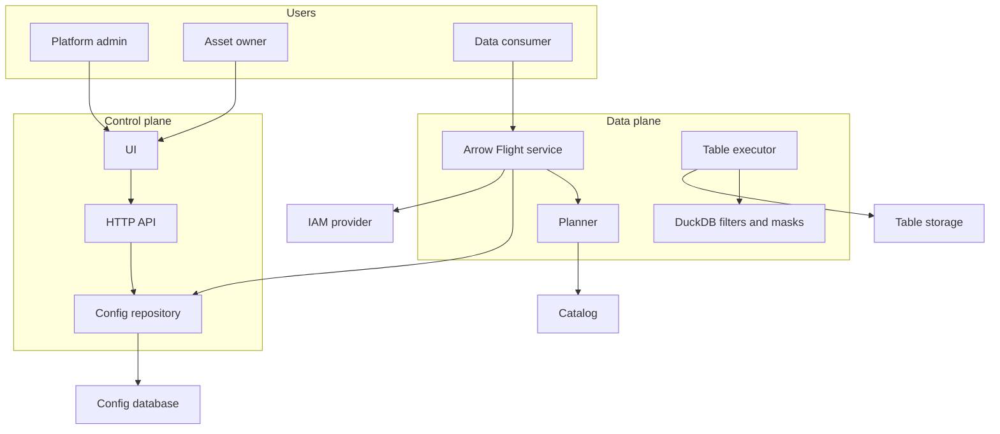
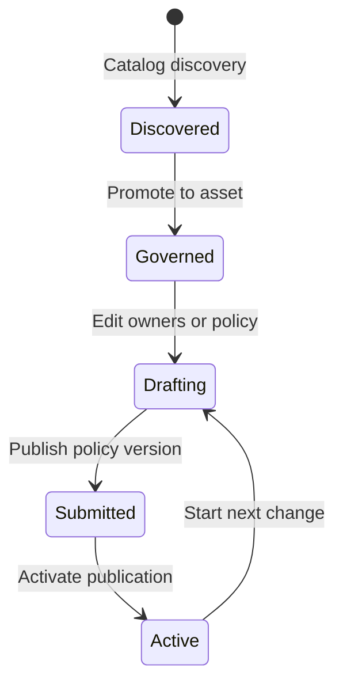
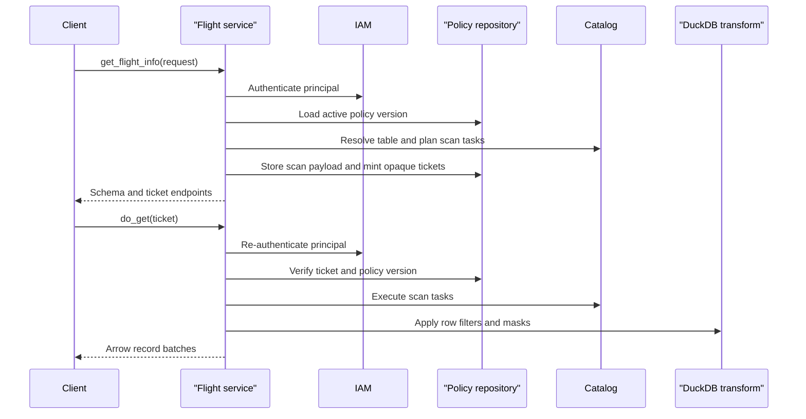

# Concepts

dal-obscura separates policy management from governed reads. The control plane
owns configuration and publication. The data plane performs reads through Arrow
Flight and applies the active policy version.

## System Shape

## Core Objects

| Object | Meaning |
| --- | --- |
| Catalog | A configured source that can discover tables. |
| Discovered table | A table found by catalog discovery. |
| Asset | A governed table that owners can manage. |
| Owner | A principal or group allowed to edit policy for an asset. |
| Policy rule | A grant, column selection, row filter, or mask. |
| Policy version | An asset-scoped submitted policy snapshot. |
| Publication | The active policy version used by reads. |
| Ticket | A short-lived opaque reference used by Flight `do_get`. |

The UI is asset-first. Internal runtime details such as tenant or cell IDs are
kept out of normal user workflows.

## Asset Lifecycle

## Read Lifecycle

## Policy Evaluation

Policy rules decide whether a principal can read an asset, which columns are
visible, which row filter applies, and which masks are applied to columns.

Row filters and masks are DuckDB SQL expressions. This keeps policy behavior
close to the execution engine and makes expressions testable.

## Persistence

Use Postgres for persistent control-plane state in shared and deployed
environments. SQLite is useful for local development and tests, but it is not
the recommended datastore when state must survive restarts reliably.
