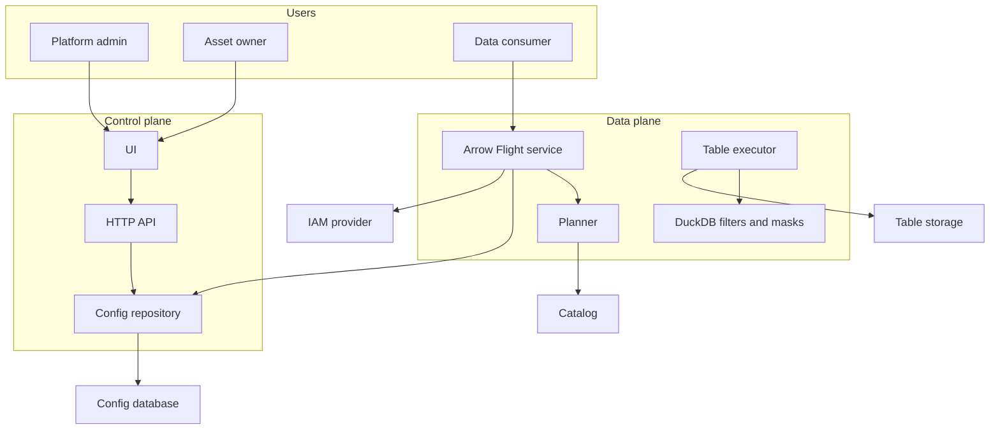
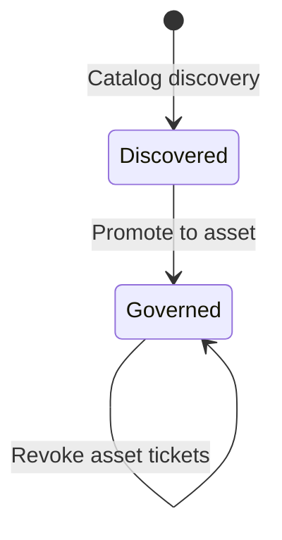
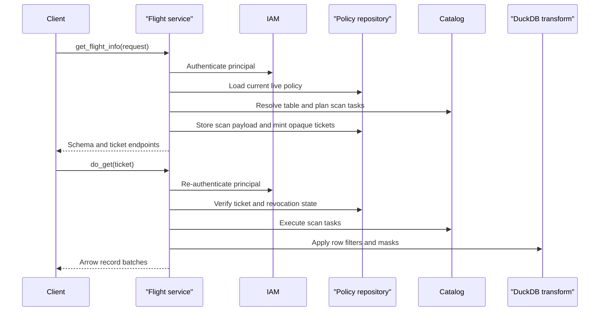

# Concepts

dal-obscura separates configuration management from governed reads. The control
plane owns live workspace configuration and asset policy. The data plane
performs Arrow Flight reads under the current policy when a read is planned.

## Contents

- [System Shape](#system-shape)
- [Core Objects](#core-objects)
- [Asset Lifecycle](#asset-lifecycle)
- [Read Lifecycle](#read-lifecycle)
- [Policy Evaluation](#policy-evaluation)
- [Catalog Resolution](#catalog-resolution)
- [Persistence](#persistence)
- [Compatibility Notes](#compatibility-notes)

## System Shape

```mermaid
flowchart TB
    subgraph Users
        admin["Platform admin"]
        owner["Asset owner"]
        reader["Data consumer"]
    end

    subgraph ControlPlane["Control plane"]
        ui["UI"]
        api["HTTP API"]
        repo["Config repository"]
    end

    subgraph DataPlane["Data plane"]
        flight["Arrow Flight service"]
        planner["Planner"]
        executor["Table executor"]
        transform["DuckDB filters and masks"]
    end

    idp["IAM provider"]
    db["Config database"]
    catalog["Catalog"]
    warehouse["Table storage"]

    admin --> ui
    owner --> ui
    ui --> api
    api --> repo --> db
    reader --> flight
    flight --> idp
    flight --> repo
    flight --> planner --> catalog
    executor --> warehouse
    executor --> transform
```

## Core Objects

| Object | Meaning |
| --- | --- |
| Catalog | Configured source that discovers tables and resolves governed targets. |
| Discovered table | Table found by catalog discovery before it is governed. |
| Asset | Governed table that owners can manage. |
| Owner | Principal or group allowed to edit policy for an asset. |
| Policy rule | Explicit grant with columns, optional row filter, and optional masks. |
| Policy revision | Monotonic asset policy counter used to reject stale edits. |
| Live policy | Current validated rules used for new read plans. |
| Ticket | Short-lived opaque reference used by Flight `do_get`. |

The public product model is asset-first: catalogs, assets, owners, policies,
policy revisions, and settings. Tenant and cell records are internal runtime
partitioning details.

## Asset Lifecycle

```mermaid
stateDiagram-v2
    [*] --> Discovered: Catalog discovery
    Discovered --> Governed: Promote to asset
    Governed --> Governed: Save owners or policy directly
    Governed --> Governed: Revoke asset tickets
```

Asset policy edits save directly after validation and optimistic revision
checking. New reads use the updated policy. Existing tickets keep the access
captured when they were issued until expiry, unless an owner revokes them.

## Read Lifecycle

```mermaid
sequenceDiagram
    participant Client
    participant Flight as "Flight service"
    participant IAM
    participant Repo as "Policy repository"
    participant Catalog
    participant Engine as "DuckDB transform"

    Client->>Flight: get_flight_info(request)
    Flight->>IAM: Authenticate principal
    Flight->>Repo: Load current live policy
    Flight->>Catalog: Resolve table and plan scan tasks
    Flight->>Repo: Store scan payload and mint opaque tickets
    Flight-->>Client: Schema and ticket endpoints
    Client->>Flight: do_get(ticket)
    Flight->>IAM: Re-authenticate principal
    Flight->>Repo: Verify ticket and revocation state
    Flight->>Catalog: Execute scan tasks
    Flight->>Engine: Apply row filters and masks
    Flight-->>Client: Arrow record batches
```

The ticket is the source of truth for `do_get`. Clients cannot replay a modified
plan request during streaming. Policy edits affect newly planned reads; an owner
can revoke the asset's tickets to stop outstanding access before ticket expiry.

## Policy Evaluation

Policies decide whether a principal can read an asset, which columns are
visible, which row filter applies, and which masks apply to sensitive columns.

Default behavior is deny. Matching grants can expose columns, add row filters,
and define masks. Row filters and masks are DuckDB SQL expressions so behavior
stays close to the execution engine and can be tested with the same SQL shape.

## Catalog Resolution

Catalogs resolve administrator-configured targets into executable table
readers. The built-in SQL Iceberg adapter and qualified catalog/table-format
plugins use the same admission, live-configuration, and path-rule boundaries;
arbitrary dynamic module imports and unqualified backend values are rejected.

The Iceberg table format owns schema extraction, scan-task planning, and
execution. It creates parallel scan tasks from Iceberg file work where possible.

## Persistence

Use Postgres for persistent control-plane state in shared and deployed
environments. SQLite is useful for local development and tests, but it is not
the recommended datastore when state must survive restarts reliably.

Services do not run migrations automatically. Run `dal-obscura-migrate upgrade`
and `dal-obscura-migrate check` explicitly.

## Compatibility Notes

- Public tenant and cell endpoints were removed.
- Asset policy is saved directly with optimistic revision checks. There is no
  policy draft, review, publication, or workspace bundle lifecycle.
- Ticket authorization stays captured until expiry unless the asset owner
  explicitly revokes the asset's outstanding tickets.
- Catalogs now resolve executable table readers directly; the old table
  provider registry extension point was removed.
