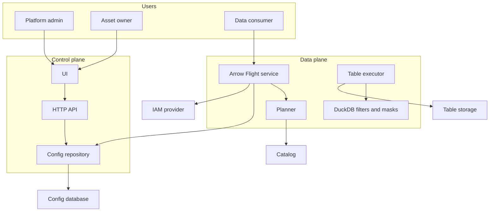
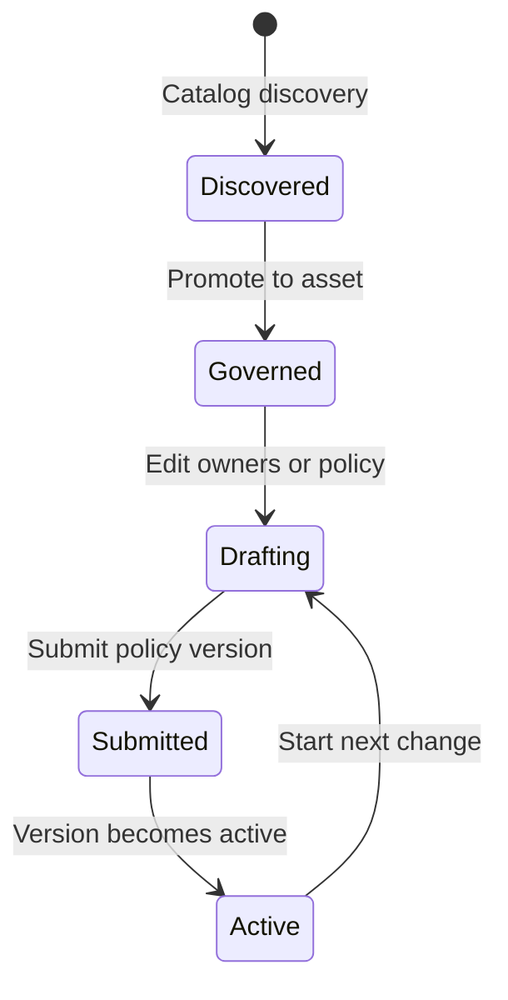
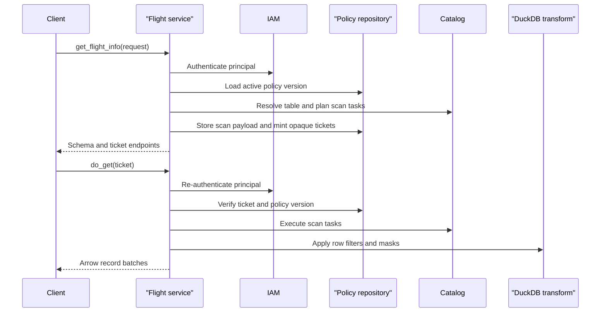

# Concepts

dal-obscura separates policy management from governed reads. The control plane
owns workspace configuration and policy versions. The data plane performs Arrow
Flight reads and enforces the active policy version for each asset.

## Contents

- [System Shape](#system-shape)
- [Core Objects](#core-objects)
- [Asset Lifecycle](#asset-lifecycle)
- [Read Lifecycle](#read-lifecycle)
- [Policy Evaluation](#policy-evaluation)
- [Catalog Resolution](#catalog-resolution)
- [Persistence](#persistence)
- [Compatibility Notes](#compatibility-notes)

## System Shape

```mermaid
flowchart TB
    subgraph Users
        admin["Platform admin"]
        owner["Asset owner"]
        reader["Data consumer"]
    end

    subgraph ControlPlane["Control plane"]
        ui["UI"]
        api["HTTP API"]
        repo["Config repository"]
    end

    subgraph DataPlane["Data plane"]
        flight["Arrow Flight service"]
        planner["Planner"]
        executor["Table executor"]
        transform["DuckDB filters and masks"]
    end

    idp["IAM provider"]
    db["Config database"]
    catalog["Catalog"]
    warehouse["Table storage"]

    admin --> ui
    owner --> ui
    ui --> api
    api --> repo --> db
    reader --> flight
    flight --> idp
    flight --> repo
    flight --> planner --> catalog
    executor --> warehouse
    executor --> transform
```

## Core Objects

| Object | Meaning |
| --- | --- |
| Catalog | Configured source that discovers tables and resolves governed targets. |
| Discovered table | Table found by catalog discovery before it is governed. |
| Asset | Governed table that owners can manage. |
| Owner | Principal or group allowed to edit policy for an asset. |
| Policy rule | Explicit grant with columns, optional row filter, and optional masks. |
| Policy version | Asset-scoped submitted policy snapshot. |
| Active policy set | Internal published representation used by reads. |
| Ticket | Short-lived opaque reference used by Flight `do_get`. |

The public product model is asset-first: catalogs, assets, owners, policies,
policy versions, and settings. Tenant and cell records are internal runtime
partitioning details.

## Asset Lifecycle

```mermaid
stateDiagram-v2
    [*] --> Discovered: Catalog discovery
    Discovered --> Governed: Promote to asset
    Governed --> Drafting: Edit owners or policy
    Drafting --> Submitted: Submit policy version
    Submitted --> Active: Version becomes active
    Active --> Drafting: Start next change
```

Publishing is scoped to one asset. Treat it as submitting a new policy version
for that asset, not as a global workspace release.

## Read Lifecycle

```mermaid
sequenceDiagram
    participant Client
    participant Flight as "Flight service"
    participant IAM
    participant Repo as "Policy repository"
    participant Catalog
    participant Engine as "DuckDB transform"

    Client->>Flight: get_flight_info(request)
    Flight->>IAM: Authenticate principal
    Flight->>Repo: Load active policy version
    Flight->>Catalog: Resolve table and plan scan tasks
    Flight->>Repo: Store scan payload and mint opaque tickets
    Flight-->>Client: Schema and ticket endpoints
    Client->>Flight: do_get(ticket)
    Flight->>IAM: Re-authenticate principal
    Flight->>Repo: Verify ticket and policy version
    Flight->>Catalog: Execute scan tasks
    Flight->>Engine: Apply row filters and masks
    Flight-->>Client: Arrow record batches
```

The ticket is the source of truth for `do_get`. Clients cannot replay a modified
plan request during streaming.

## Policy Evaluation

Policies decide whether a principal can read an asset, which columns are
visible, which row filter applies, and which masks apply to sensitive columns.

Default behavior is deny. Matching grants can expose columns, add row filters,
and define masks. Row filters and masks are DuckDB SQL expressions so behavior
stays close to the execution engine and can be tested with the same SQL shape.

## Catalog Resolution

Catalogs resolve governed targets into executable table readers. The current
workspace API field is named `module`; built-in short values such as `iceberg`,
`files`, `delta`, and `unity` are accepted. Publication normalizes those values
into data-plane runtime config.

Custom catalog code implements `CatalogPlugin.resolve_table()` and returns a
`TableFormat`. A `TableFormat` owns schema extraction, scan-task planning, and
execution. Backends should produce parallel scan tasks whenever their storage
format exposes splittable work such as files, fragments, partitions, or row
groups.

## Persistence

Use Postgres for persistent control-plane state in shared and deployed
environments. SQLite is useful for local development and tests, but it is not
the recommended datastore when state must survive restarts reliably.

Services do not run migrations automatically. Run `dal-obscura-migrate upgrade`
and `dal-obscura-migrate check` explicitly.

## Compatibility Notes

- Public tenant and cell endpoints were removed.
- Public publication endpoints were replaced by policy-version history.
- Catalogs now resolve executable table readers directly; the old table
  provider registry extension point was removed.
