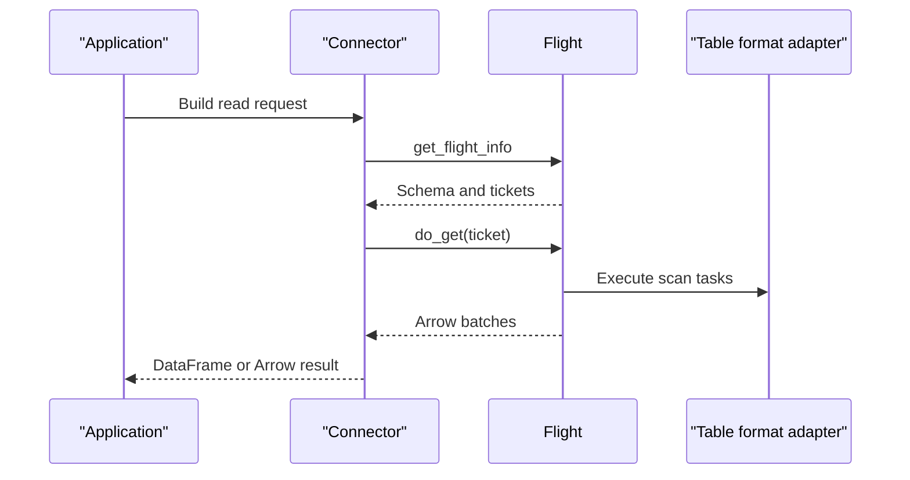
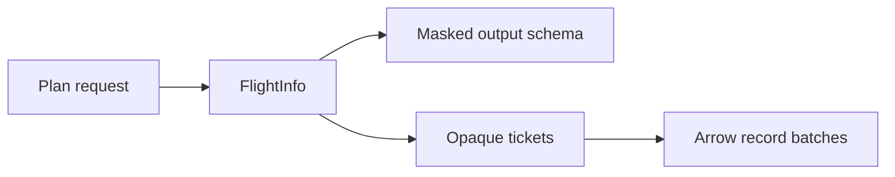

# Connectors

Clients read governed data through Arrow Flight. The current connector surface is
kept small: a Python client helper, JVM libraries, and a Spark datasource.

## Read Path



## Available Surfaces

| Surface | Location | Use when |
| --- | --- | --- |
| Python SDK | `src/dal_obscura/connectors/python_sdk.py` | You need a simple Python read helper. |
| Java client | `connectors/jvm/dal-obscura-client-java` | You are integrating with JVM applications. |
| Spark datasource | `connectors/jvm/spark3-datasource` | You want Spark reads through dal-obscura. |
| Contract fixtures | `connectors/contract-fixtures` | You are testing connector request compatibility. |

See [`connectors/README.md`](../connectors/README.md) for connector-specific
build and usage details.

## Request Contract

Connectors send a logical read request to `get_flight_info`. The data plane
returns an output schema and short-lived tickets. The connector then exchanges
each ticket through `do_get`.



The ticket is the source of truth for `do_get`. Connectors should not assume
they can mutate or replay the original plan request during streaming.

## Testing Connectors

Use the contract fixtures when changing request shape or error behavior:

```text
connectors/contract-fixtures/
  plan-requests/
  filter-translation/
  error-cases/
```

For JVM connector changes:

```bash
mvn -f connectors/jvm/pom.xml verify
```

For end-to-end reads, use any configured dal-obscura environment with one
allowed principal and one denied principal. The bundled local examples are
useful references, but connector behavior should not depend on a specific
reference stack.
