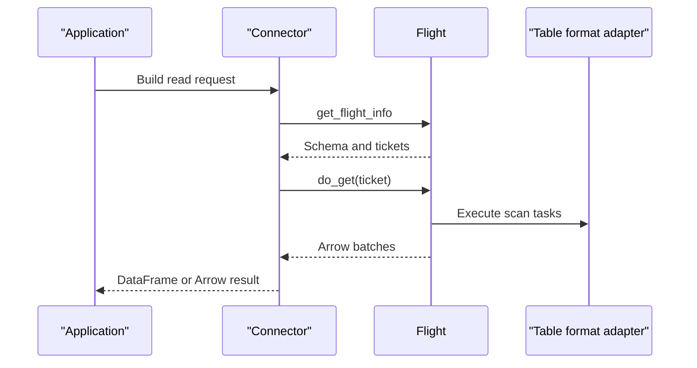

# Connectors

Clients read governed data through Arrow Flight. Use this guide to choose a
client surface and understand the read path. For protocol details and JVM build
commands, see the [connector workspace README](../connectors/README.md).

## Contents

- [Read Path](#read-path)
- [Choose A Surface](#choose-a-surface)
- [Spark Read](#spark-read)
- [Python Read](#python-read)
- [Connector Rules](#connector-rules)
- [Testing Connectors](#testing-connectors)

## Read Path


```mermaid
sequenceDiagram
    participant App as "Application"
    participant Client as "Connector"
    participant Flight
    participant Table as "Table format adapter"

    App->>Client: Build read request
    Client->>Flight: get_flight_info
    Flight-->>Client: Schema and tickets
    Client->>Flight: do_get(ticket)
    Flight->>Table: Execute scan tasks
    Flight-->>Client: Arrow batches
    Client-->>App: DataFrame or Arrow result
```

The data plane owns planning, authentication, authorization, row-filter
validation, ticket minting, and masking. Connectors submit read requests and
exchange returned tickets.

## Choose A Surface

| Surface | Location | Use when |
| --- | --- | --- |
| Python SDK | `src/dal_obscura/connectors/python_sdk.py` | You need PyArrow tables, batches, or DuckDB relations. |
| Java client | `connectors/jvm/dal-obscura-client-java` | You are integrating with JVM applications. |
| Spark datasource | `connectors/jvm/spark3-datasource` | You want Spark DataFrame reads through dal-obscura. |
| Contract fixtures | `connectors/contract-fixtures` | You are testing request-shape compatibility. |

## Spark Read

```java
spark.read()
     .format("dal_obscura")
     .option("dal.uri", "grpc+tcp://localhost:8815")
     .option("dal.catalog", "analytics")
     .option("dal.target", "default.users")
     .option("dal.auth.token", token)
     .load();
```

Use the `dal.*` namespace for Spark options. Unprefixed option names are
rejected. Pass custom headers as `dal.auth.header.<name>`.

## Python Read

```python
from dal_obscura.connectors import DalObscuraClient

with DalObscuraClient("grpc+tcp://localhost:8815", auth_token=token) as client:
    table = client.read_table(
        catalog="analytics",
        target="default.users",
        columns=["id", "email"],
        row_filter="region = 'US'",
    )
```

The Python SDK can return schemas, planned Flight endpoints, record batches,
PyArrow tables, and DuckDB relations.

## Connector Rules

- Send protobuf `dal_obscura.flight.v1.PlanRequest` in
  `FlightDescriptor.command`.
- Use `protocol_version: 1`.
- Treat tickets as opaque.
- Reuse the returned ticket endpoints; do not rebuild stream requests from the
  original plan request.
- Send auth material on schema, plan, and fetch calls unless the deployment
  authenticates entirely through transport identity such as mTLS.
- Render connector row filters as validated DuckDB SQL expressions.

## Testing Connectors

Use contract fixtures when request shape or error behavior changes:

```text
connectors/contract-fixtures/
  plan-requests/
  filter-translation/
  error-cases/
```

For JVM connector changes:

```bash
mvn -f connectors/jvm/pom.xml verify
```

For end-to-end reads, use a configured dal-obscura environment with one allowed
principal and one denied principal. The local examples are useful references,
but connector behavior should not depend on a specific reference stack.
