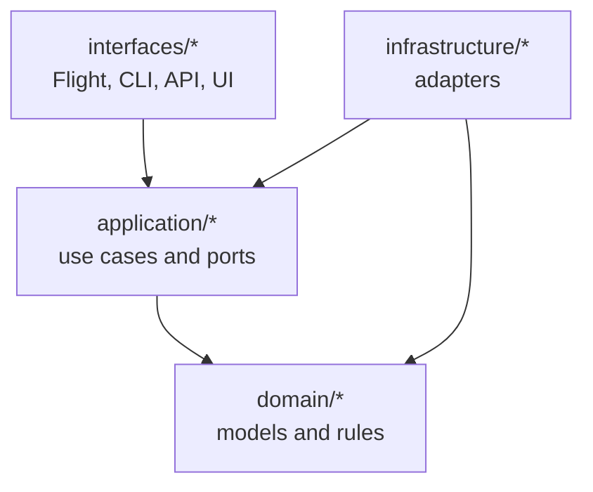
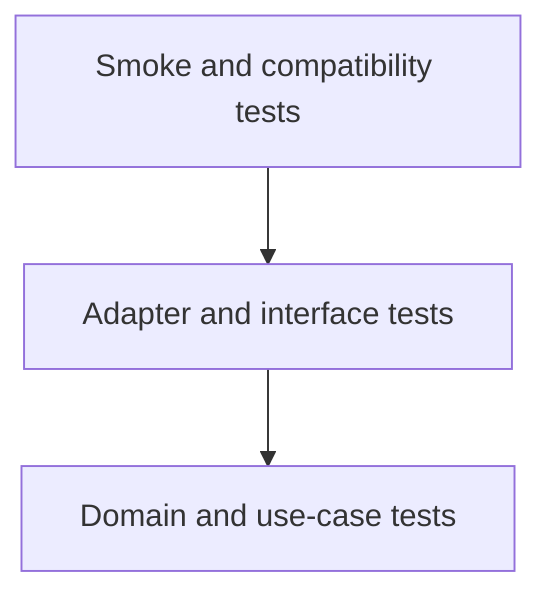

# Development Guide

This guide is for contributors changing the service, UI, policies, or
connectors.

## Architecture

dal-obscura follows a hexagonal architecture. Domain and application code should
not depend on transport adapters.

The public control-plane model is workspace-first: assets, catalogs, owners,
policies, policy versions, and settings. Tenant, cell, and publication records
are internal runtime implementation details.



## Repo Map

| Path | Purpose |
| --- | --- |
| `src/dal_obscura/interfaces/flight` | Arrow Flight transport. |
| `src/dal_obscura/control_plane` | HTTP API, UI assets, repositories, and control-plane workflows. |
| `src/dal_obscura/application` | Use cases and ports. |
| `src/dal_obscura/domain` | Pure models, policy logic, planning types. |
| `src/dal_obscura/infrastructure` | Catalogs, auth, ticket codecs, table formats, transforms. |
| `ui` | React control-plane UI. |
| `connectors` | JVM connector modules and contract fixtures. |
| `examples` | Auth examples, manifests, and local reference environments. |
| `tests` | Unit, integration, smoke, and benchmark tests. |

## Setup

```bash
uv sync --dev
```

Run the service help:

```bash
uv run dal-obscura --help
```

## Test Pyramid



Prefer focused tests near the behavior you changed. Do not add tests for
example seeding or setup scripts unless those scripts contain non-trivial
behavior that would be costly to debug manually.

## Common Checks

```bash
uv run pytest
uv run ruff check .
uv run ruff format .
uv run ty check
```

Focused policy and streaming checks:

```bash
uv run pytest tests/domain/access_control/test_row_filters.py \
  tests/interfaces/flight/test_service_streaming.py::test_parse_descriptor_rejects_unsafe_row_filter_sql \
  tests/infrastructure/adapters/test_duckdb_transform.py -q
```

JVM connectors:

```bash
mvn -f connectors/jvm/pom.xml verify
```

## Frontend

Read [Frontend Conventions](frontend.md) before changing the UI.

Run the API:

```bash
uv run dal-obscura-control-plane
```

Run the frontend dev server:

```bash
cd ui
pnpm install
pnpm dev
```

Vite proxies `/v1` to `http://127.0.0.1:8820`. Production-like local runs use
the Caddy UI image:

```bash
docker build -f ui/Dockerfile -t dal-obscura-control-plane-ui:local .
docker run --rm -p 127.0.0.1:8821:8080 \
  -e DAL_OBSCURA_API_BASE_URL=http://127.0.0.1:8820 \
  dal-obscura-control-plane-ui:local
```

## Change Guidance

| Change | Update |
| --- | --- |
| Policy behavior | Domain policy tests and data-plane enforcement tests. |
| Ticket payloads | Ticket model, codec, planning, fetching, and connector fixtures. |
| Masking | DuckDB projection logic and masked schema behavior. |
| Catalog behavior | Catalog adapter tests and discovery UI/API behavior if visible. |
| UI workflow | API helper types, feature page, UI tests, and Caddy image build. |
| Connector contract | Contract fixtures and JVM/Python connector tests. |

## Release-Oriented Checklist

- `uv run ruff check .`
- `uv run ty check`
- `uv run pytest`
- `mvn -f connectors/jvm/pom.xml verify` when JVM connector behavior changed.
- Run UI tests and rebuild the Caddy UI image when `ui/` changed.

## Extension Notes

Catalog implementations resolve governed targets into executable table readers.
Built-in catalog config uses `type`; Python module strings are not part of the
public config format. Add a catalog by implementing `CatalogPlugin.resolve_table()`
and returning a `TableFormat` directly.

Breaking API/config changes in this simplification pass:

- Public tenant and cell endpoints were removed.
- Public publication endpoints were replaced by policy-version history.
- Catalog config now uses typed catalog entries instead of Python module strings.
- Catalogs now resolve executable table readers directly; table provider
  registry extension is removed.
