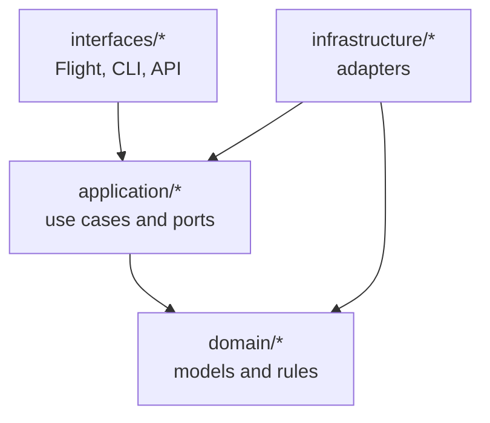
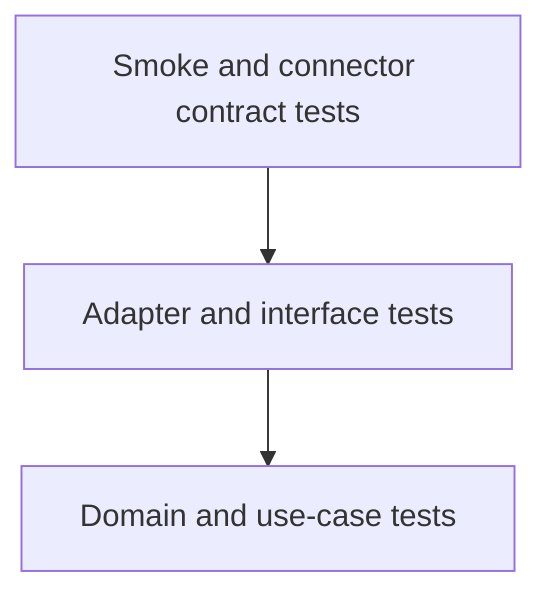

# Development Guide

This guide is for contributors changing the service, policies, or connectors.

## Contents

- [Architecture](#architecture)
- [Repo Map](#repo-map)
- [Setup](#setup)
- [Test Pyramid](#test-pyramid)
- [Common Checks](#common-checks)
- [Change Guidance](#change-guidance)
- [Release-Oriented Checklist](#release-oriented-checklist)
- [Extension Notes](#extension-notes)

## Architecture

dal-obscura follows a hexagonal architecture. Domain and application code should
not depend on transport adapters.

The public control-plane model is workspace-first: assets, catalogs, owners,
policies, policy versions, and settings. Tenant, cell, and publication records
are internal runtime implementation details.


```mermaid
flowchart TB
    interfaces["interfaces/*\nFlight, CLI, API"] --> app["application/*\nuse cases and ports"]
    app --> domain["domain/*\nmodels and rules"]
    infra["infrastructure/*\nadapters"] --> app
    infra --> domain
```

## Repo Map

| Path | Purpose |
| --- | --- |
| `src/dal_obscura/data_plane/interfaces/flight` | Arrow Flight transport. |
| `src/dal_obscura/control_plane` | HTTP API, repositories, and control-plane workflows. |
| `src/dal_obscura/data_plane/application` | Data-plane use cases and ports. |
| `src/dal_obscura/common` | Shared models, policy logic, catalog contracts, tickets, and config-store ORM. |
| `src/dal_obscura/data_plane/infrastructure` | Catalogs, auth, ticket codecs, table formats, transforms. |
| `ui` | Standalone React/Vite control-plane UI. |
| `connectors` | JVM connector modules and contract fixtures. |
| `examples` | Auth examples, manifests, and local reference environments. |
| `tests` | Unit, integration, smoke, and benchmark tests. |

## Setup

```bash
uv sync --dev --extra server --extra sqlite
```

Run command help:

```bash
uv run dal-obscura --help
uv run dal-obscura-control-plane --help
uv run dal-obscura-migrate --help
```

## Test Pyramid


```mermaid
flowchart TB
    e2e["Smoke and connector contract tests"] --> integration["Adapter and interface tests"]
    integration --> unit["Domain and use-case tests"]
```

Prefer focused tests near the behavior you changed. Do not add tests for
example seeding or setup scripts unless those scripts contain non-trivial
behavior that would be costly to debug manually.

## Common Checks

```bash
uv run pytest
uv run ruff check .
uv run ruff format .
uv run ty check
```

Focused policy and streaming checks:

```bash
uv run pytest tests/domain/access_control/test_row_filters.py \
  tests/interfaces/flight/test_service_streaming.py::test_parse_descriptor_rejects_unsafe_row_filter_sql \
  tests/infrastructure/adapters/test_duckdb_transform.py -q
```

JVM connectors:

```bash
mvn -f connectors/jvm/pom.xml verify
```

Spark profile-specific verification:

```bash
mvn -f connectors/jvm/pom.xml -Pspark-3.5 verify
mvn -f connectors/jvm/pom.xml -Pspark-4.0 verify
```

## Change Guidance

| Change | Update |
| --- | --- |
| Policy behavior | Domain policy tests and data-plane enforcement tests. |
| Ticket payloads | Ticket model, codec, planning, fetching, and connector fixtures. |
| Masking | DuckDB projection logic and masked schema behavior. |
| Catalog behavior | Catalog adapter tests and operator manifest validation. |
| Connector contract | Contract fixtures and JVM/Python connector tests. |
| Public Python interface | Pydoc docstrings with a short example. |

## Release-Oriented Checklist

- `uv run ruff check .`
- `uv run ty check`
- `uv run pytest`
- `mvn -f connectors/jvm/pom.xml verify` when JVM connector behavior changed.

## Extension Notes

Catalog implementations resolve governed targets into executable table readers.
The current workspace API catalog module is the fixed Iceberg catalog adapter.
Other backend/module values are rejected during publication.

Add a catalog by implementing `CatalogPlugin.resolve_table()` and returning a
`TableFormat` directly. A table format owns schema extraction, scan-task
planning, and execution.

Current compatibility notes:

- Public tenant and cell endpoints were removed.
- Public publication endpoints were replaced by policy-version history.
- Catalogs now resolve executable table readers directly; the old table
  provider registry extension point was removed.
