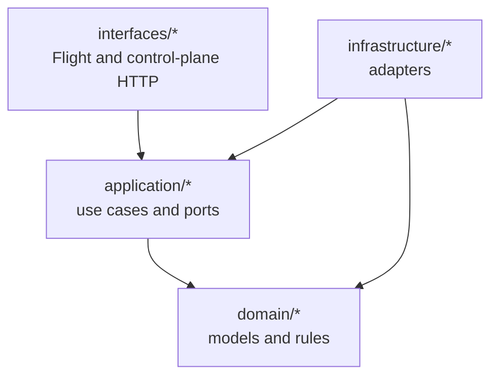
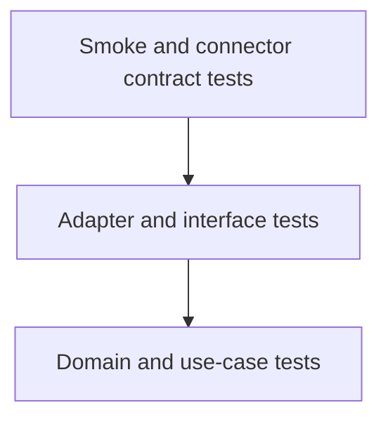

# Development Guide

This guide is for contributors changing the service, policies, or connectors.

## Contents

- [Architecture](#architecture)
- [Repo Map](#repo-map)
- [Setup](#setup)
- [Test Pyramid](#test-pyramid)
- [Common Checks](#common-checks)
- [Change Guidance](#change-guidance)
- [Release-Oriented Checklist](#release-oriented-checklist)
- [Extension Notes](#extension-notes)
- [Current Runtime Rules](#current-runtime-rules)

## Architecture

dal-obscura follows a hexagonal architecture. Domain and application code should
not depend on transport adapters. The authenticated control plane writes
validated catalogs, assets, owners, and live policies directly to the shared
configuration database. Asset policy updates use an optimistic revision; the
data plane reads the current records for new plans. Existing tickets continue
with their captured permissions until expiry unless explicitly revoked.


```mermaid
flowchart TB
    interfaces["interfaces/*\nFlight and control-plane HTTP"] --> app["application/*\nuse cases and ports"]
    app --> domain["domain/*\nmodels and rules"]
    infra["infrastructure/*\nadapters"] --> app
    infra --> domain
```

## Repo Map

| Path | Purpose |
| --- | --- |
| `src/dal_obscura/data_plane/interfaces/flight` | Arrow Flight transport. |
| `src/dal_obscura/control_plane` | Authenticated routes, live configuration use cases, and repositories. |
| `src/dal_obscura/data_plane/application` | Data-plane use cases and ports. |
| `src/dal_obscura/common` | Shared models, policy logic, catalog contracts, tickets, and config-store ORM. |
| `src/dal_obscura/data_plane/infrastructure` | Catalogs, auth, ticket codecs, table formats, transforms. |
| `connectors` | JVM connector modules and contract fixtures. |
| `examples` | Auth examples, sample data, and local reference environments. |
| `tests` | Unit, integration, smoke, and benchmark tests. |

## Setup

```bash
uv sync --dev --extra server --extra sqlite
```

Run command help:

```bash
uv run dal-obscura --help
uv run dal-obscura-control-plane --help
uv run dal-obscura-migrate --help
```

## Test Pyramid


```mermaid
flowchart TB
    e2e["Smoke and connector contract tests"] --> integration["Adapter and interface tests"]
    integration --> unit["Domain and use-case tests"]
```

Follow TDD for new behavior: add or extend the owning behavioral test, implement
the smallest change, then run focused and broad checks. Prefer real outputs and
observable rejection or cleanup over source spelling, private SQL strings, or
mock bookkeeping. Add integration tests when they exercise an independent
transport, database, provider, browser, or consumer boundary.

Behavioral ownership:

- Policy resolution: `tests/domain/access_control/` and
  `tests/application/access_flow/`.
- Administrative permissions and HTTP contracts: `tests/interfaces/control_plane/`
  and `tests/control_plane/`.
- Filters, masks, schemas, streaming, and memory: DuckDB and Iceberg adapter tests
  and `tests/interfaces/flight/test_service_streaming.py`.
- Request snapshots, provider leases, revision races, and tickets: live configuration
  adapter tests, `tests/integration/`, and ticket adapter/access-flow tests.
- Plugin contracts and IO boundaries: `tests/plugin_platform/`, package conformance
  tests, and integration suites.
- Browser and client behavior: governance UI tests, Python connector tests, and
  the JVM workspace.

Keep benchmarks separate from functional tests. See
[read execution invariants](read-execution-invariants.md) for specific guarantees
and their executable evidence. Avoid setup-script tests unless they cover
non-trivial behavior that would be costly to debug manually.

## Common Checks

```bash
uv run pytest
uv run ruff check .
uv run ruff format .
uv run ty check
```

Focused policy and streaming checks:

```bash
uv run pytest tests/domain/access_control/test_row_filters.py \
  tests/interfaces/flight/test_service_streaming.py::test_parse_descriptor_rejects_unsafe_row_filter_sql \
  tests/infrastructure/adapters/test_duckdb_transform.py -q
```

JVM connectors:

```bash
mvn -f connectors/jvm/pom.xml verify
```

Spark profile-specific verification:

```bash
mvn -f connectors/jvm/pom.xml -Pspark-3.5 verify
mvn -f connectors/jvm/pom.xml -Pspark-4.0 verify
```

Benchmarks for planner, masking, filtering, and streaming changes:

```bash
uv run pytest tests/benchmarks --benchmark-only
uv run pytest tests/benchmarks/test_masking_row_filter_benchmarks.py --benchmark-only --benchmark-json .benchmarks/row-filter-mask.json
uv run pytest tests/benchmarks/test_iceberg_multifile_benchmark.py --benchmark-only --benchmark-json .benchmarks/iceberg-multifile.json
uv run pytest tests/benchmarks/test_ticket_to_response_benchmark.py --benchmark-only
```

Compare JSON with same-host baselines before claiming an improvement. For repeated
capacity runs and environment metadata, see the
[capacity runbook](../evaluation/capacity/README.md).

## Change Guidance

| Change | Update |
| --- | --- |
| Policy behavior | Domain policy tests and data-plane enforcement tests. |
| Ticket payloads | Ticket model, codec, planning, fetching, and connector fixtures. |
| Masking | DuckDB projection logic and masked schema behavior. |
| Catalog behavior | Catalog adapter tests, discovery tests, and plugin conformance. |
| Connector contract | Contract fixtures and JVM/Python connector tests. |
| Public Python interface | Pydoc docstrings with a short example. |

## Release-Oriented Checklist

- `uv run ruff check .`
- `uv run ty check`
- `uv run pytest`
- `mvn -f connectors/jvm/pom.xml verify` when JVM connector behavior changed.

## Extension Notes

Catalog implementations resolve governed targets into executable table
readers. The workspace API admits the built-in Iceberg adapter and plugins
listed in the read-only plugin lock. Plugin identities come from their
validated static descriptors; callers cannot submit arbitrary implementation
paths or backend module names. Asset and policy changes are edited through the
authenticated control-plane API and take effect for new plans after a
successful revision-checked write.

Implement external adapters against the [public plugin SDK](../packages/plugin-api/README.md),
not service internals. Catalog plugins return structured table handles; the
admitted table-format plugin owns schema extraction, bounded scan-task planning,
and lazy execution. Declare output formats, capabilities, and handle versions in
the static descriptor, run the [conformance kit](../packages/plugin-conformance/README.md),
and admit the exact wheel through the plugin lock. See
[operators](operators.md) for lock configuration and artifact admission.

## Current Runtime Rules

- Keep the control plane and data plane stateless apart from the shared
  configuration and ticket records in the database.
- Preserve the internal ticket serialization boundary; do not broaden pickle
  use or place client-controlled content in trusted ticket payloads.
- Preserve issued-ticket access until expiry unless the asset owner explicitly
  revokes tickets. Cover both default retention and revocation-on-save.
- Keep schema and policy revisions separate. Write policy changes with the
  caller's expected revision so concurrent edits fail closed.
- Require bounded parallel scan tasks whenever a table format exposes
  splittable work; document any backend that cannot be split.
