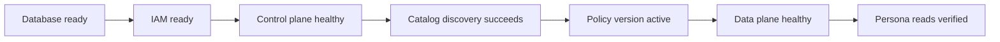
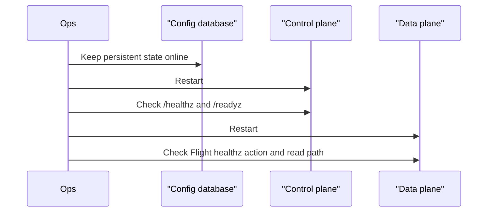

# Operator Runbook

This page is a generic checklist for running dal-obscura. For deployment
background, read [Operator Guide](operators.md).

## Service Readiness

Checklist:

- Database is reachable from control plane and data plane.
- IAM provider metadata or credentials are reachable.
- Control plane `/healthz` returns ok and `/readyz` can query the database.
- UI loads and can authenticate an administrative user.
- Catalog discovery finds the expected tables.
- Governed assets have owners.
- At least one policy version is active per governed asset.
- Data plane Arrow Flight `healthz` action returns ok.
- One allowed read and one denied read behave as expected.

## Restart

1. Keep the config database running.
2. Restart the control plane.
3. Confirm the UI, `/healthz`, and `/readyz`.
4. Restart the data plane.
5. Run one read-path check.

## Full Environment Reset

Only reset persistent state when you intentionally want to remove catalog
configuration, assets, owners, policy versions, internal active-policy records,
and tickets.

Recommended order:

1. Stop data planes.
2. Stop the control plane.
3. Snapshot or export the database if needed.
4. Drop or recreate the config database.
5. Re-run provisioning.
6. Re-run catalog discovery.
7. Re-publish policy versions.
8. Verify read personas.

## Fast Triage

| Symptom | Check |
| --- | --- |
| UI cannot sign in | IAM provider, redirect URI, browser client configuration. |
| Catalog table missing | Catalog credentials, namespace, warehouse path, discovery logs. |
| Asset owner cannot edit | Owner list includes the user's principal or group. |
| Read denied unexpectedly | Principal identity, groups, active policy version, row filters. |
| Policy change not visible | Confirm a new asset-scoped policy version was published. |
| Reads fail after restart | Database URL, ticket secret, IAM metadata, catalog credentials. |
| State disappeared | Confirm Postgres volume/database was not reset. |

## Local Reference Runbook

For a complete laptop environment, the repository includes
[`examples/demo/keycloak`](../examples/demo/keycloak/README.md). Its `./run`
helper starts Keycloak, Postgres, control plane, data plane, and seeded data.
Use it as a reference or smoke environment, not as the generic operating model.
