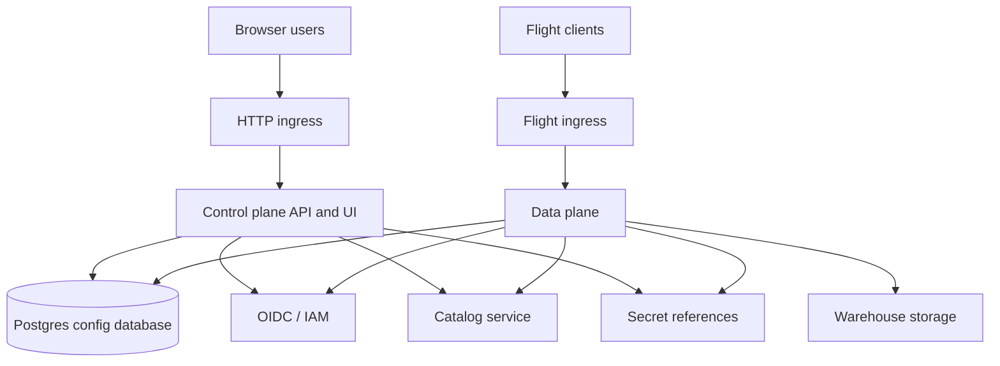
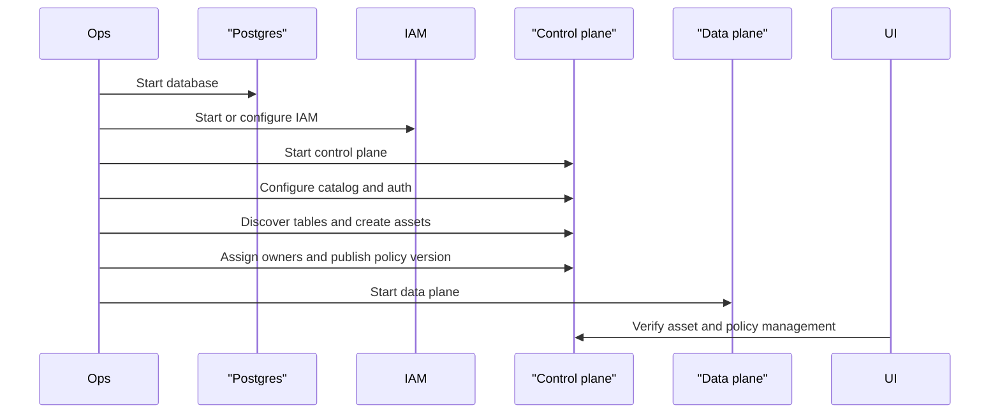

# Operator Guide

This guide is for people running dal-obscura as a service. It focuses on the
runtime pieces, persistence, deployment order, and operational checks.

## Production Shape

Postgres is the recommended datastore for persistent control-plane state. The
data plane remains stateless with respect to table data and reads configuration
from the configured repository.

## Components

| Component | Purpose |
| --- | --- |
| Control plane | HTTP API, UI, catalog discovery, assets, owners, policies, policy versions. |
| Data plane | Arrow Flight reads, authentication, ticket verification, policy enforcement. |
| Postgres | Persistent configuration, policy versions, and ticket state. |
| IAM provider | OIDC/JWKS, API key, mTLS, trusted headers, or a composite provider. |
| Catalog | Discovers and resolves tables. |
| Warehouse | Stores table metadata and data files. |

Tenant and cell records are internal runtime partitioning details. Operators
configure the public control plane through workspace-level catalog, asset,
policy, owner, runtime, and auth-provider endpoints.

## Required Decisions

| Decision | Recommendation |
| --- | --- |
| Config database | Use Postgres for shared and restart-stable environments. |
| IAM | Use OIDC/JWKS when possible. |
| Secrets | Store references in config; keep secret values in the runtime secret provider. |
| Publishing | Keep policy versions asset-scoped. |
| Catalogs | Resolve all governed tables through catalogs; do not publish standalone file paths. |
| UI exposure | Put the UI behind the same IAM posture as the API. |

## Common Environment Variables

| Variable | Used by | Meaning |
| --- | --- | --- |
| `DAL_OBSCURA_DATABASE_URL` | Control plane and data plane | SQLAlchemy database URL for config state. |
| `DAL_OBSCURA_CONTROL_PLANE_ADMIN_TOKEN` | Control plane | Bootstrap admin token for API setup. |
| `DAL_OBSCURA_CONTROL_PLANE_HOST` | Control plane | HTTP bind host. |
| `DAL_OBSCURA_CONTROL_PLANE_PORT` | Control plane | HTTP bind port. |
| `DAL_OBSCURA_CELL_ID` | Data plane | Runtime cell identifier. Keep this internal. |
| `DAL_OBSCURA_LOCATION` | Data plane | Advertised Flight endpoint location. |
| `DAL_OBSCURA_TICKET_SECRET` | Data plane | HMAC secret for opaque tickets. |

Auth-specific variables depend on the provider. See [Security](security.md).

## Startup Order

## Runbook

| Task | Action |
| --- | --- |
| Confirm API health | Open `/healthz` on the control plane or data plane. |
| Confirm UI | Open `/ui` on the control plane. |
| Confirm discovery | Run catalog discovery and verify expected tables appear. |
| Confirm governance | Promote a discovered table to an asset and publish a policy version. |
| Confirm read path | Read as at least one allowed user and one denied user. |
| Restart safely | Restart services without deleting the Postgres volume. |
| Reset local example | Use example reset helpers only for disposable local environments. |

## Operational Risks

- A stale or wrong IAM configuration can make valid users appear unauthorized.
- Secret values should not be written into catalog or policy records.
- Policy changes affect reads after a policy version is submitted, so test with real personas.
- SQLite state is easy to lose; use Postgres for anything others will try.
- Internal cell identifiers should not become user-facing concepts.
