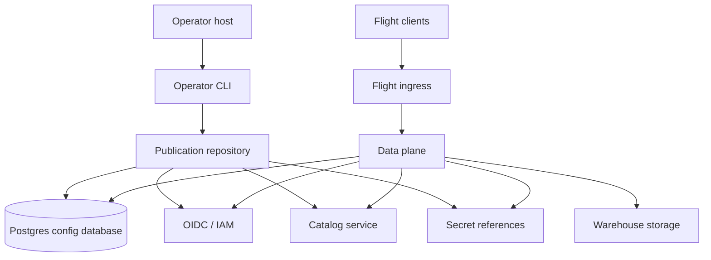
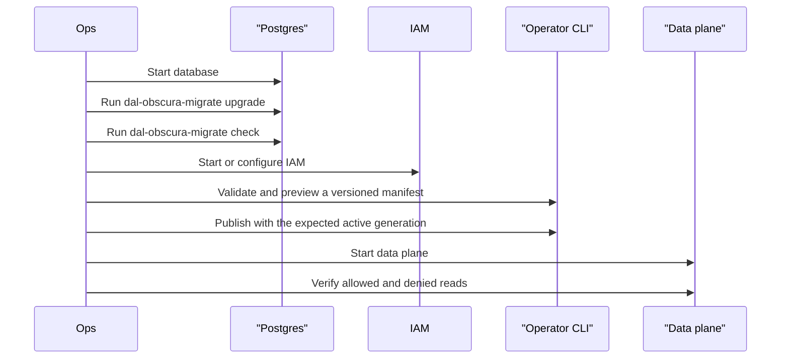

# Operator Guide

This guide is for people running dal-obscura as a service. It covers runtime
components, deployment decisions, startup order, health checks, and risks.

For incident-style steps, use the [Operator Runbook](operators-runbook.md).

## Contents

- [Production Shape](#production-shape)
- [Components](#components)
- [Required Decisions](#required-decisions)
- [Common Environment Variables](#common-environment-variables)
- [Identity-Key Migration](#identity-key-migration)
- [Startup Order](#startup-order)
- [Health And Readiness](#health-and-readiness)
- [Operational Risks](#operational-risks)

## Production Shape


```mermaid
flowchart TB
    operator["Operator host"] --> cli["Operator CLI"]
    clients["Flight clients"] --> flight_ingress["Flight ingress"]

    cli --> cp["Publication repository"]
    flight_ingress --> dp["Data plane"]

    cp --> db[("Postgres config database")]
    dp --> db
    cp --> idp["OIDC / IAM"]
    dp --> idp
    cp --> catalog["Catalog service"]
    dp --> catalog
    dp --> storage["Warehouse storage"]
    cp --> secrets["Secret references"]
    dp --> secrets
```

Use Postgres for persistent control-plane state. Data planes remain stateless
with respect to table data and read published configuration from the configured
repository.

## Components

| Component | Purpose |
| --- | --- |
| Operator CLI | Validates, previews, publishes, and reports immutable runtime generations. |
| Data plane | Arrow Flight reads, authentication, ticket verification, policy enforcement. |
| Postgres | Persistent configuration, policy versions, active policy set, and ticket state. |
| IAM provider | One configured OIDC/JWKS provider for reader authentication. |
| Catalog | Discovers tables and resolves governed targets. |
| Warehouse | Stores table metadata and data files. |

Publications are immutable manifest generations. Tenant and cell records are
runtime partitioning details.

## Required Decisions

| Decision | Recommendation |
| --- | --- |
| Config database | Use Postgres for shared and restart-stable environments. |
| IAM | Use OIDC/JWKS when possible. |
| Secrets | Store references in config; keep secret values in the runtime secret provider. |
| Publishing | Keep policy versions asset-scoped. |
| Catalogs | Resolve governed tables through catalogs; do not publish standalone file paths. |
| UI exposure | Put the UI behind the same IAM posture as the API. |
| Config-store outage | Fail closed; restore the config store before serving new requests. |

Operators still configure `DAL_OBSCURA_CELL_ID` for each data-plane process so
it can load the correct internal runtime partition.

## Common Environment Variables

| Variable | Used by | Meaning |
| --- | --- | --- |
| `DAL_OBSCURA_DATABASE_URL` | Control plane and data plane | SQLAlchemy database URL for config state. |
| `DAL_OBSCURA_CELL_ID` | Data plane | Internal runtime cell identifier. |
| `DAL_OBSCURA_LOCATION` | Data plane | Advertised Flight endpoint location. |
| `DAL_OBSCURA_TICKET_SECRET` | Data plane | HMAC secret for opaque tickets. |
| `DAL_OBSCURA_CONTROL_PLANE_CATALOG_EGRESS_ALLOWLIST` | Control plane | Comma-separated exact catalog/object-store hostnames allowed in production. |
| `DAL_OBSCURA_PLUGIN_LOCK_FILE` | Control plane and data plane | Optional operator-mounted JSON lock containing pinned five-part plugin identities; loaded before any plugin factory import. |

The plugin lock is read-only startup input. Keep it owned by the service account and
mode `0644` or stricter; symbolic links and group/world-writable files are rejected.
Its shape is `{"version": 1, "plugins": [{"kind": "catalog"|"table_format",
"plugin_id": "...", "lock": ["distribution", "version", "api", "descriptor_digest",
"artifact_digest"]}]}`. The trusted in-tree Iceberg pair remains available when no
external lock is configured.

Each catalog descriptor must declare `output_formats` with the format plugin IDs
it can produce, and both catalog and table-format descriptors declare their
supported `handle_versions`. Pair admission uses these declarations before
capability checks.

Generate a lock only after installing the exact reviewed wheels, and name every
admitted entry explicitly. The builder reads static wheel descriptors without
importing plugin factories, derives descriptor and installed-file digests, writes
atomically, and refuses to overwrite an existing lock:

```sh
PYTHONPATH=src uv run python scripts/build_plugin_lock.py \
  --output /etc/dal-obscura/plugin-lock.json \
  --plugin catalog:iceberg.rest \
  --plugin catalog:manifest \
  --plugin table_format:parquet.dataset
```

Review the generated file into the immutable deployment artifact. Both planes
must mount the same file; a missing, changed, or incompatible lock fails startup
before any factory import.

See [Security](security.md) and the runnable [OIDC example](../examples/auth/keycloak-oidc/README.md).

## Identity-Key Migration

Federated owner, grant, draft, audit, and session records use the exact OIDC
issuer together with an escaped principal value. Existing databases created
before that encoding was introduced must be converted explicitly during a
maintenance window. The service does not perform a runtime fallback.

Preview the conversion against the same database used by the control plane:

```sh
DAL_OBSCURA_DATABASE_URL='postgresql+psycopg://...' \
  uv run dal-obscura-migrate identity-keys
```

Proceed only when the JSON report has `safe_to_apply: true` and both
`unresolved` and `ambiguous` are empty. Stop and obtain operator reapproval for
any value in either list. Apply the reviewed conversion in one transaction:

```sh
DAL_OBSCURA_DATABASE_URL='postgresql+psycopg://...' \
  uv run dal-obscura-migrate identity-keys --apply
```

Take a database backup first, stop or drain control-plane writers, and run the
preview again after the write lock is in place. The command changes only text
and JSON identity fields; it does not delete customer data and does not read or
rewrite the protected pickle ticket payload boundary. A failed apply rolls back
the transaction. Run `dal-obscura-migrate check` before restarting services.

## Startup Order


```mermaid
sequenceDiagram
    participant Ops
    participant DB as "Postgres"
    participant IAM
    participant CLI as "Operator CLI"
    participant DP as "Data plane"

    Ops->>DB: Start database
    Ops->>DB: Run dal-obscura-migrate upgrade
    Ops->>DB: Run dal-obscura-migrate check
    Ops->>IAM: Start or configure IAM
    Ops->>CLI: Validate and preview a versioned manifest
    Ops->>CLI: Publish with the expected active generation
    Ops->>DP: Start data plane
    Ops->>DP: Verify allowed and denied reads
```

Services never run config-store migrations automatically at startup.

## Health And Readiness

The data plane can expose an optional HTTP health app:

- `GET /healthz`: health app liveness.
- `GET /readyz`: published runtime readiness. The check is ready only after the
  active publication, runtime settings, and at least one enabled auth provider
  can be loaded.

Operational verification should also include:

- `dal-obscura-admin status` reports the expected active generation.
- At least one manifest asset has an active policy.
- One allowed read and one denied read behave as expected.

## Operational Risks

- Wrong IAM claims can make valid users appear unauthorized.
- Secret values should not be written into catalog, auth-provider, or policy
  records.
- Policy changes affect reads after a policy version is submitted; test with
  real personas before exposing the environment.
- SQLite state is easy to lose; use Postgres for anything shared.
- Internal cell identifiers should not become user-facing concepts.
- Data planes fail closed when they cannot read active published configuration.
