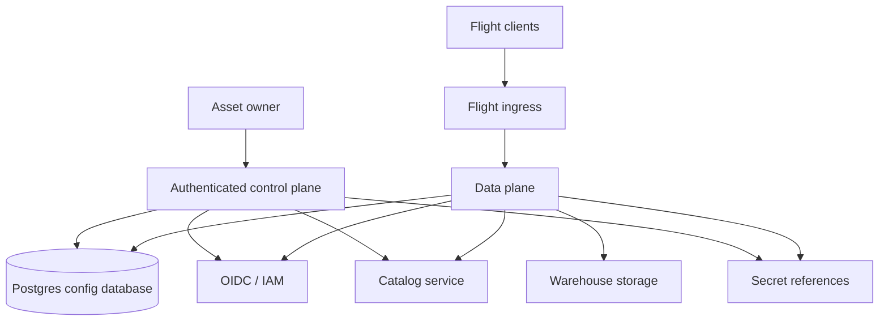
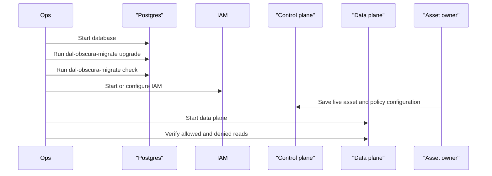

# Operator Guide

This guide is for people running dal-obscura as a service. It covers runtime
components, deployment decisions, startup order, health checks, and risks.

For incident-style steps, use the [Operator Runbook](operators-runbook.md).

## Contents

- [Production Shape](#production-shape)
- [Components](#components)
- [Required Decisions](#required-decisions)
- [Common Environment Variables](#common-environment-variables)
- [Startup Order](#startup-order)
- [Health And Readiness](#health-and-readiness)
- [Operational Risks](#operational-risks)

## Production Shape


```mermaid
flowchart TB
    owner["Asset owner"] --> cp["Authenticated control plane"]
    clients["Flight clients"] --> flight_ingress["Flight ingress"]

    flight_ingress --> dp["Data plane"]

    cp --> db[("Postgres config database")]
    dp --> db
    cp --> idp["OIDC / IAM"]
    dp --> idp
    cp --> catalog["Catalog service"]
    dp --> catalog
    dp --> storage["Warehouse storage"]
    cp --> secrets["Secret references"]
    dp --> secrets
```

Use Postgres for persistent control-plane state. The control plane writes
validated live configuration. Data planes read canonical catalog, asset, and
policy records while planning new requests and remain stateless with respect to
table data.

This release has a single initial migration for the live schema. It is not an
upgrade path from earlier config-store revisions; start with an empty database.

## Components

| Component | Purpose |
| --- | --- |
| Control plane | Authenticated UI and API for live configuration, policy tests, and ticket revocation. |
| Data plane | Arrow Flight reads, authentication, ticket verification, policy enforcement. |
| Postgres | Persistent live configuration revisions and ticket state. |
| IAM provider | One configured OIDC/JWKS provider for reader authentication. |
| Catalog | Discovers tables and resolves governed targets. |
| Warehouse | Stores table metadata and data files. |

Policy writes validate a complete replacement and check the asset's expected
revision before commit. There is no workspace bundle or separate review/publish
stage. Issued tickets keep their captured access until expiry unless the owner
revokes them.

## Required Decisions

| Decision | Recommendation |
| --- | --- |
| Config database | Use Postgres for shared and restart-stable environments. |
| IAM | Use OIDC/JWKS when possible. |
| Secrets | Store references in config; keep secret values in the runtime secret provider. |
| Policy changes | Write directly with an expected revision; decide whether to revoke existing asset tickets. |
| Catalogs | Resolve governed tables through catalogs; avoid standalone file paths. |
| UI exposure | Put the UI behind the same IAM posture as the API. |
| Config-store outage | Fail closed; restore the config store before serving new requests. |

Every data-plane process connected to the same configuration database loads the
same deployment settings, catalog namespace, and policies.

## Common Environment Variables

| Variable | Used by | Meaning |
| --- | --- | --- |
| `DAL_OBSCURA_DATABASE_URL` | Control plane and data plane | SQLAlchemy database URL for config state. |
| `DAL_OBSCURA_LOCATION` | Data plane | Advertised Flight endpoint location. |
| `DAL_OBSCURA_TICKET_SECRET` | Data plane | HMAC secret for opaque tickets. |
| `DAL_OBSCURA_CONTROL_PLANE_CATALOG_EGRESS_ALLOWLIST` | Control plane | Comma-separated exact catalog/object-store hostnames allowed in production. |
| `DAL_OBSCURA_SECRET_PROVIDER_CONFIG` | Control plane and data plane | JSON provider configuration. Production requires `scope_grants`, mapping exact `catalog:<name>`/`identity` scopes to operator-approved secret keys. |
| `DAL_OBSCURA_SECRET_PROVIDER_MODULE` | Control plane and data plane | Admitted secret provider module; production currently supports the environment provider only. |
| `DAL_OBSCURA_PLUGIN_LOCK_FILE` | Control plane and data plane | Optional operator-mounted JSON lock containing pinned five-part plugin identities; loaded before any plugin factory import. |

The plugin lock is read-only startup input. Keep it owned by the service account and
mode `0644` or stricter; symbolic links and group/world-writable files are rejected.
Its shape is `{"version": 1, "plugins": [{"kind": "catalog"|"table_format",
"plugin_id": "...", "lock": ["distribution", "version", "api", "descriptor_digest",
"artifact_digest"]}]}`. The trusted in-tree Iceberg pair remains available when no
external lock is configured.

Each catalog descriptor must declare `output_formats` with the format plugin IDs
it can produce, and both catalog and table-format descriptors declare their
supported `handle_versions`. Pair admission uses these declarations before
capability checks.

Generate a lock only after installing the exact reviewed wheels, and name every
admitted entry explicitly. The builder reads static wheel descriptors without
importing plugin factories, derives descriptor and installed-file digests, writes
atomically, and refuses to overwrite an existing lock:

```sh
PYTHONPATH=src uv run python scripts/build_plugin_lock.py \
  --output /etc/dal-obscura/plugin-lock.json \
  --plugin catalog:iceberg.rest \
  --plugin catalog:manifest \
  --plugin table_format:parquet.dataset
```

Review the generated file into the immutable deployment artifact. Both planes
must mount the same file; a missing, changed, or incompatible lock fails startup
before any factory import.

See [Security](security.md) and the runnable [OIDC example](../examples/auth/keycloak-oidc/README.md).

For upgrades from 0.1, follow the [core 0.2 cutover](core-cutover.md) before
starting either plane. API 2 requires rebuilt plugins and a fresh artifact lock.

## Startup Order


```mermaid
sequenceDiagram
    participant Ops
    participant DB as "Postgres"
    participant IAM
    participant CP as "Control plane"
    participant DP as "Data plane"
    participant Owner as "Asset owner"

    Ops->>DB: Start database
    Ops->>DB: Run dal-obscura-migrate upgrade
    Ops->>DB: Run dal-obscura-migrate check
    Ops->>IAM: Start or configure IAM
    Owner->>CP: Save live asset and policy configuration
    Ops->>DP: Start data plane
    Ops->>DP: Verify allowed and denied reads
```

Services never run config-store migrations automatically at startup.

## Health And Readiness

The data plane can expose an optional HTTP health app:

- `GET /healthz`: health app liveness.
- `GET /readyz`: runtime readiness. The check is ready only after live
  configuration, runtime settings, and at least one enabled auth provider can
  be loaded.

Operational verification should also include:

- The authenticated workspace shows the expected live catalogs and assets.
- Each governed asset has a configured live policy and assigned owner.
- One allowed read and one denied read behave as expected.

## Operational Risks

- Wrong IAM claims can make valid users appear unauthorized.
- Secret values should not be written into catalog, auth-provider, or policy
  records.
- New reads use the current saved policy. Existing tickets keep their captured
  permissions until expiry unless the asset owner revokes them. Confirm the
  revocation choice for high-impact changes.
- SQLite state is easy to lose; use Postgres for anything shared.
- Configuration has one namespace per deployment; no routing identifier is required.
- Data planes fail closed when they cannot read live configuration.
