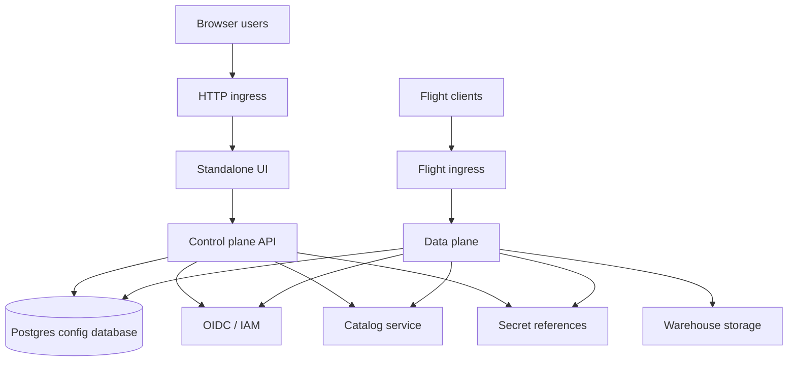
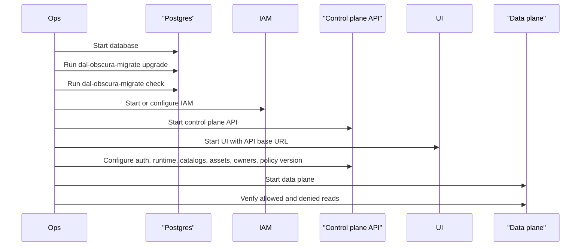

# Operator Guide

This guide is for people running dal-obscura as a service. It covers runtime
components, deployment decisions, startup order, health checks, and risks.

For incident-style steps, use the [Operator Runbook](operators-runbook.md).

## Contents

- [Production Shape](#production-shape)
- [Components](#components)
- [Required Decisions](#required-decisions)
- [Common Environment Variables](#common-environment-variables)
- [Startup Order](#startup-order)
- [Health And Readiness](#health-and-readiness)
- [Operational Risks](#operational-risks)

## Production Shape

```mermaid
flowchart TB
    users["Browser users"] --> http["HTTP ingress"]
    clients["Flight clients"] --> flight_ingress["Flight ingress"]

    http --> ui["Standalone UI"]
    ui --> cp["Control plane API"]
    flight_ingress --> dp["Data plane"]

    cp --> db[("Postgres config database")]
    dp --> db
    cp --> idp["OIDC / IAM"]
    dp --> idp
    cp --> catalog["Catalog service"]
    dp --> catalog
    dp --> storage["Warehouse storage"]
    cp --> secrets["Secret references"]
    dp --> secrets
```

Use Postgres for persistent control-plane state. Data planes remain stateless
with respect to table data and read published configuration from the configured
repository.

## Components

| Component | Purpose |
| --- | --- |
| Control plane API | Catalog discovery, assets, owners, policies, policy versions, runtime settings. |
| Standalone UI | Browser workflow for admins and asset owners. |
| Data plane | Arrow Flight reads, authentication, ticket verification, policy enforcement. |
| Postgres | Persistent configuration, policy versions, active policy set, and ticket state. |
| IAM provider | OIDC/JWKS, API key, mTLS, trusted headers, or composite provider. |
| Catalog | Discovers tables and resolves governed targets. |
| Warehouse | Stores table metadata and data files. |

The public control-plane model is workspace-first: assets, catalogs, owners,
policies, policy versions, and settings. Tenant and cell records are internal
runtime partitioning details.

## Required Decisions

| Decision | Recommendation |
| --- | --- |
| Config database | Use Postgres for shared and restart-stable environments. |
| IAM | Use OIDC/JWKS when possible. |
| Secrets | Store references in config; keep secret values in the runtime secret provider. |
| Publishing | Keep policy versions asset-scoped. |
| Catalogs | Resolve governed tables through catalogs; do not publish standalone file paths. |
| UI exposure | Put the UI behind the same IAM posture as the API. |
| Stale config | Keep fail-closed default unless a short bounded stale window is an explicit risk decision. |

Operators still configure `DAL_OBSCURA_CELL_ID` for each data-plane process so
it can load the correct internal runtime partition.

## Common Environment Variables

| Variable | Used by | Meaning |
| --- | --- | --- |
| `DAL_OBSCURA_DATABASE_URL` | Control plane and data plane | SQLAlchemy database URL for config state. |
| `DAL_OBSCURA_CONTROL_PLANE_ADMIN_TOKEN` | Control plane | Bootstrap admin token for API setup. |
| `DAL_OBSCURA_CONTROL_PLANE_HOST` | Control plane | HTTP bind host. |
| `DAL_OBSCURA_CONTROL_PLANE_PORT` | Control plane | HTTP bind port. |
| `DAL_OBSCURA_CELL_ID` | Data plane | Internal runtime cell identifier. |
| `DAL_OBSCURA_LOCATION` | Data plane | Advertised Flight endpoint location. |
| `DAL_OBSCURA_TICKET_SECRET` | Data plane | HMAC secret for opaque tickets. |
| `DAL_OBSCURA_ALLOW_STALE_CONFIG_SECONDS` | Data plane | Optional bounded stale-config window during short config-store outages. |

Auth-specific variables depend on the provider. See [Security](security.md) and
the runnable [authentication examples](../examples/auth/README.md).

## Startup Order

```mermaid
sequenceDiagram
    participant Ops
    participant DB as "Postgres"
    participant IAM
    participant CP as "Control plane API"
    participant UI
    participant DP as "Data plane"

    Ops->>DB: Start database
    Ops->>DB: Run dal-obscura-migrate upgrade
    Ops->>DB: Run dal-obscura-migrate check
    Ops->>IAM: Start or configure IAM
    Ops->>CP: Start control plane API
    Ops->>UI: Start UI with API base URL
    Ops->>CP: Configure auth, runtime, catalogs, assets, owners, policy version
    Ops->>DP: Start data plane
    Ops->>DP: Verify allowed and denied reads
```

Services never run config-store migrations automatically at startup.

## Health And Readiness

Control-plane probes are served by the main FastAPI app:

- `GET /healthz`: process liveness only; no authentication required.
- `GET /readyz`: config-store readiness; no authentication required. Database
  failures return `503`.

The data plane can expose an optional HTTP health app:

- `GET /healthz`: health app liveness.
- `GET /readyz`: published runtime readiness. The check is ready only after the
  active publication, runtime settings, and at least one enabled auth provider
  can be loaded.

Operational verification should also include:

- API docs at `/docs`.
- UI can reach the configured API base URL.
- Catalog discovery returns expected tables.
- At least one governed asset has an active policy version.
- One allowed read and one denied read behave as expected.

## Operational Risks

- Wrong IAM claims can make valid users appear unauthorized.
- Secret values should not be written into catalog, auth-provider, or policy
  records.
- Policy changes affect reads after a policy version is submitted; test with
  real personas before exposing the environment.
- SQLite state is easy to lose; use Postgres for anything shared.
- Internal cell identifiers should not become user-facing concepts.
- By default, data planes fail closed when they cannot read active published
  configuration. Set `DAL_OBSCURA_ALLOW_STALE_CONFIG_SECONDS` only when short
  config-store outages should keep previously authorized reads working.
