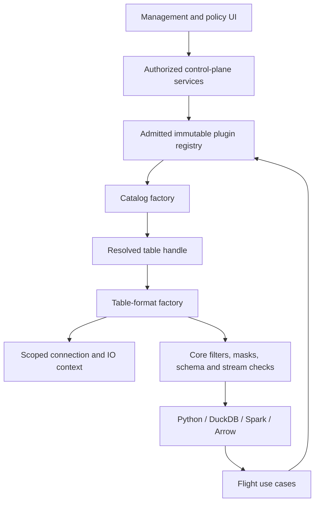

# Plugin architecture contract

Updated planning contract, 2026-09-13. The active queue is
[N01–N16](IMPLEMENTATION_PLAN.md). This describes required boundaries, not a
production-readiness claim. [Cleanup](CLEANUP_PLAN.md) and [acceptance](ACCEPTANCE.md)
supersede old compatibility requirements outside the protected pickle boundary.

## 1. Extension boundaries

Provide two independently registered plugin kinds:

1. **Catalog plugins** validate connection-specific configuration, enumerate
   namespaces/tables, and resolve an authorized identifier to a table handle.
2. **Table-format plugins** interpret a table handle, return an authoritative
   schema, plan bounded parallel scan work, and execute Arrow batches.

Storage/IO access is a core-controlled service supplied to adapters, not a free-form
third plugin marketplace in version 1. Consumers use the existing Flight contract
and do not load catalog plugins. Iceberg is a table format; SQL/REST describe catalog
access; Parquet is a file encoding that needs dataset membership/snapshot semantics
before it can be a complete table-format adapter. Keep those distinctions explicit.
Version 1 is read-only: no catalog/table creation, source writes, schema mutation,
compaction, or source deletion API is added to the plugin SDK.

The core owns authentication, asset lookup, authorization, policy resolution, SQL
validation, masked output schema, ticket minting/verification, policy-version
checks, resource admission, runtime output validation, and audit. A plugin cannot
declare these checks unnecessary. Pushdown is an optimization: the core retains
the full approved row restriction and reapplies it before output. Row/delete
semantics intrinsic to a format remain the format's responsibility and must pass
conformance; returning deleted rows is never an acceptable fallback.



This diagram shows responsibility flow; control-plane discovery/schema calls do
not read customer rows or emit Flight data.

## 2. Installed packages and trust

Use Python distribution entry points for discovery. Entry points advertise
installed components; their group/name/object reference model is standardized by
[PyPA](https://packaging.python.org/en/latest/specifications/entry-points/).
Declare groups in
[`project.entry-points`](https://packaging.python.org/en/latest/specifications/pyproject-toml/)
and inspect installed distributions through
[`importlib.metadata`](https://docs.python.org/3/library/importlib.metadata.html).

Proposed groups:

```toml
[project.entry-points."dal_obscura.catalogs.v1"]
"iceberg.sql" = "dal_obscura_iceberg.catalogs:sql_factory"
"iceberg.rest" = "dal_obscura_iceberg.catalogs:rest_factory"

[project.entry-points."dal_obscura.table_formats.v1"]
"iceberg" = "dal_obscura_iceberg.formats:iceberg_factory"
```

These names are the version 1 contract, not current installed package names.
Reject duplicate `(kind, plugin_id)` registrations; never depend on installation
order. Allow only lowercase ASCII IDs matching `[a-z][a-z0-9_.-]{0,63}`.

Operators build an immutable environment from pinned wheels with verified build
artifact hashes. An operator-mounted plugin lock records kind, ID, API major,
distribution name, exact version, descriptor digest, artifact digest, and approved
environment/image digest. Startup compares installed metadata and shipped static
descriptors with that lock before importing factories. Wheel provenance is verified
at build/install time; reading a distribution version at runtime does not prove
the installed files match an original wheel. Record both checks separately.

Read bounded descriptor JSON as package data using distribution file metadata;
do not import the plugin merely to learn its description. Resolve the descriptor
only within its installed distribution. Import only enabled, admitted factories.
Reject missing packages, incompatible API/config versions, duplicate IDs, malformed
descriptors, or inconsistent locks before readiness. Unapproved unrelated packages
may be installed, but their entry points must not be imported or offered in the UI.

No HTTP package upload/install/update endpoint. No imports from request strings,
catalog metadata, database `module` strings, or remote JSON schemas. No package
network resolution during service startup or requests. Production rejects editable
plugin installations; development may use an explicitly marked development lock.

**Security boundary:** an imported Python plugin has the process's privileges.
All in-process plugins must be trusted, reviewed operator code. An allowlist,
Protocol, timeout, or “scoped context” does not sandbox malicious code. Deployment
egress restrictions and least privilege contain accidents and some compromise
effects. Supporting hostile plugins would require a separately reviewed process/OS
isolation design and is outside version 1. Never market version 1 as such a sandbox.

## 3. SDK and typed contracts

Create an independently buildable `dal-obscura-plugin-api` distribution under
`packages/plugin-api/`. It may depend on the supported Arrow runtime but not on
PyIceberg, FastAPI, SQLAlchemy, UI code, or control/data-plane implementation modules.
Use small frozen value objects and explicit Protocols. Keep transport serialization
in core adapters. The SDK does not implement policy resolution.

Required contract objects and operations:

- `PluginDescriptor`: kind, ID, distribution/API/config versions, display text,
  finite capabilities, supported handle versions/formats, and bounded config form.
- `CatalogConfig`: immutable validated provider-specific options and secret
  references, with instance ID and configuration revision. Unknown keys fail.
- `TableIdentifier`: namespace as a tuple of segments plus a name. Do not split
  names on dots or infer paths from a display string.
- `DiscoveryPage`: bounded entries and an opaque continuation token. Core binds
  tokens to actor, connection revision, query, and expiry; request arguments cannot
  turn a token into arbitrary provider state.
- `TableHandle`: catalog instance/revision, canonical table identity, format ID,
  handle version, snapshot identity, and scoped metadata reference. It is not a
  user-supplied file path. Provider-private runtime attachments remain internal,
  bounded, and absent from API responses/audit.
- `SchemaDescriptor`: response-contract version, authoritative schema/snapshot
  identities, structured field segments, complete types/nullability, stable IDs
  where available, and a versioned canonical digest. Do not fingerprint `repr`.
- `ExecutionContext`: cancellation/deadline, resource admission, scoped IO and
  secrets, safe logger/metrics, and correlation identity. Never a database session,
  browser token, unrestricted environment accessor, or mutable global registry.
- Catalog operations: `validate_config`, `list_namespaces`, `list_tables`,
  `resolve_table`, and deterministic `close`. Pagination may be unavailable only
  when a documented bounded listing operation fits the service limits.
- Format factory: validate compatible handle/config, then open an executable
  format exposing schema, plan, execute, and close behavior through an adapter to
  the current `TableFormat` contract.

Reuse existing core `FieldPath` interpretation and escaping. SDK schema segments
are data, not a second dot-path parser or SQL renderer. Convert them into the
existing canonical model at one tested adapter boundary. Do not relocate any
pickle-referenced class to accomplish SDK extraction.

Capabilities are an enumerated, versioned vocabulary, not arbitrary booleans with
undefined behavior. Include nested struct/list/map support, field-ID stability,
snapshot reads, supported scalar types, partition/row-group splitting, projection
and filter pushdown, delete semantics, and cancellation. Core intersects plugin
capabilities with qualified release capabilities and policy requirements. Unknown
or required-but-unsupported capabilities fail closed before tickets are minted.

Use stable error codes: `unsupported_capability`, `invalid_configuration`,
`permission_denied`, `not_found`, `schema_changed`, `resource_limit`,
`deadline_exceeded`, `provider_unavailable`, and `plugin_incompatible`. Map these
to documented HTTP/Flight errors at transport boundaries; no provider traceback,
credential, object URI, or raw row value is a public error message.

The new core format wrapper must not capture live execution contexts, connections,
locks, open scanners, or credentials in a serialized task. Keep its new plugin
state limited to validated IDs, bounded internal plan data, and scoped references.
The core supplies the request-scoped context to SDK operations at execution time
through the wrapper; third-party plugins never import private core context globals.
Do not add context fields to legacy `ScanTask` or Iceberg objects. Conformance checks
new task serialization/cleanup through the unchanged serializer and preserves old
fixtures; a non-serializable factory closure is not an acceptable plugin task.

## 4. Schema identity and policy evolution

Define canonical JSON encoding version 1 with deterministic object key ordering,
ordered field arrays, tagged scalar/container types, precise decimal/time metadata,
all field/list-element/map-key/map-value IDs, names, nullability, and a specified
allowlist of semantic metadata. Hash its UTF-8 bytes with SHA-256. Keep data snapshot
identity distinct from schema digest; document which snapshot changes require
review and which merely require planning a new consistent read.

Approval records the admitted field identities and paths, canonical schema digest,
table identity, connection revision, policy hash, evaluator/fixture/persona digests,
and relevant plugin contract/config generations. Expanding `*` or a parent at review
time produces an explicit admitted set: newly added children never become readable
without new approval. Reject incompatible type, identity, or binding changes.

Federated control-plane principals use the canonical escaped form
`<issuer>|u|<subject>` for a user and `<issuer>|g|<group>` for a group. The type tag
is required because a subject may literally be named `group:<name>`; treating that
string as a group marker would transfer ownership or grants. Local development
identities retain their separate unscoped representation. Legacy federated values
are converted only by the maintenance command documented in the operator guide;
serving requests do not parse or guess old keys.

For formats without stable IDs, use schema-scoped deterministic synthetic IDs;
these are not evidence of identity across schema versions. Require reapproval after
any schema change until a separately tested safe migration rule exists. Never reuse
an old grant because a new field has the same display name.

Schemas with ambiguous/colliding paths, duplicate IDs, unsupported types, oversized
metadata, or exceeded limits fail before evaluation and planning. Empty result sets
retain the exact authorized masked Arrow schema. Plugins cannot add columns or
change a task's declared output schema during execution.

## 5. IO, secrets, resource limits, and concurrency

Use one connection resolver in both planes for validation, diagnostic, discovery,
schema, evaluation, review, planning, and execution. Resolve secrets by connection
and purpose only when needed. New plugin task objects hold scoped references, not
raw secrets. Preserve existing pickle behavior; inspect and separately document
legacy trusted object contents instead of silently changing them.

Provider adapters must enforce permitted schemes, authority/port, object prefixes,
and local filesystem roots on every resource, including metadata-returned locations,
redirects, delete files, and alternate endpoints. Reject path traversal, symlink
escapes, metadata service access, unintended loopback/private destinations, and
credential-bearing URLs. Explicit operator-approved local/private services are
allowed through the same policy model. Account for DNS changes at connection time;
host validation without enforced destination control is insufficient.

Adapters configure bounded SDK retries, connection/read timeouts, listing pages,
metadata bytes, and cancellation. Core applies total elapsed deadlines and shared
admission limits. A timed-out future that leaves work running is not cancellation.
If a dependency cannot be interrupted, execute the bounded operation in a supervised
worker process with cleanup, or reject that deployment capability. This containment
does not change the trusted-plugin security model or existing task serializer.

Initial qualification targets (X00 records hardware; these are proposed limits,
not measured results): schema at most 10,000 nodes/depth 64/2 MiB encoded metadata;
listing page at most 500 entries, at most 10,000 entries per bounded traversal;
metadata operation deadline 10 seconds; synthetic evaluation at most 100 rows/1 MiB
input/5 seconds; at most 8 metadata/evaluation operations per process and 2 per
session. Reject before materialization wherever possible, and stop upstream work
when cumulative limits are crossed. X21 measures aggregate multi-worker capacity;
per-process limits must not be described as cluster-wide quotas.

Build immutable registry generations outside request paths and swap atomically.
Do not mutate shared catalog configuration during requests. New admissions use
the active generation. Explicit disable/revoke rejects new plans and follows the
documented ticket-invalidation behavior. Ordinary generation replacement may drain
in-flight references, but must not delay security revocation silently.

Plugin admission also has explicit operator lifecycle metadata: `enabled` admits
new factories, `draining` stops new admissions while existing generation leases
finish, `disabled` can be re-enabled after review, `revoked` is terminal for
admission, and `removed` is terminal. Lifecycle transitions are validated and
reported independently of the immutable distribution lock and historical
publication records. The current process-local registry enforces the admission
boundary; persistence, lease accounting, and ticket invalidation remain required
before lifecycle controls can be treated as a production drain workflow.

## 6. Persistence and deliberate cutover

Use the existing database for stable plugin IDs, config schema versions,
configuration/binding revisions, canonical schema IDs and publication requirements.
Preserve immutable historical publications. Remove replaced runtime readers; valid
old mutable records may use an explicit offline migration, never a compatibility
interpretation layer in serving requests.

Map only known exact legacy class strings through a static mapping; reject unknown
legacy strings. Do not retain suffix-based Iceberg inference or generic imports.
Provide an operator dry-run showing every migrated/unsupported record. Apply only
explicitly; restart cannot migrate, reset, reseed, or republish.

Keep existing pickle serialization functions, payload shape, referenced classes
and import paths intact. Leave original definitions in place; do not move them and
create a facade. Test trusted fixtures against the selected worker artifact.
Stop admissions and drain/expire or explicitly invalidate tickets before a breaking
cutover to one artifact set. Never opportunistically reinterpret payloads.
Do not add fields to serialized task objects without separate owner approval.

Registry/package checks use existing publication/runtime metadata or explicit
database records outside unchanged pickle blobs. Reject unsupported versions at
startup. Test maintenance-mode upgrade and rollback through an isolated backup and
the previous complete artifact set; do not add mixed-version runtime shims.

## 7. UI and configuration lifecycle

Core exposes admitted plugin descriptors and the qualified catalog/format pair
matrix through an authenticated metadata endpoint. Connection forms render a safe
declarative subset: text, numeric, enum, boolean, and secret-reference fields with
length/range constraints. No plugin HTML, JavaScript, remote references, or arbitrary
schema evaluator. Backend validation is authoritative and stricter than form hints.

Persist/edit/test a draft connection separately from activation. Activation must
show impacted assets, authorize the actor, compare expected revisions, validate
schema/policy compatibility, publish a new generation, and audit the outcome. Failed
activation leaves current serving configuration intact. Authentication/runtime
settings also need explicit staged activation and recovery semantics. Distinguish
configured, validated, active, unavailable, and disabled states in UI and API.

Disabling a connection stops admissions and enforces the selected revocation/drain
contract. Retirement must not delete source data or break historical audit records.
The browser can configure and manage approved integrations; it cannot install code.

## 8. Qualification targets and further onboarding

Initial required supported pairs:

- `iceberg.sql` catalog → `iceberg` format.
- `iceberg.rest` catalog → `iceberg` format.
- `manifest` catalog → `parquet.dataset` format, supplied by an independently built
  wheel using only the public SDK.

The manifest catalog uses operator-controlled immutable dataset manifests with
explicit file membership, schema, revision, and approved roots. A dataset is not
“all files currently found in a directory.” Plan Parquet row groups in parallel;
reject mixed/incompatible schemas or changing membership. Do not pretend this
adapter implements Iceberg transactions, deletes, or time travel.

An unsupported pair, such as `iceberg.rest` → `parquet.dataset`, must fail explicitly
unless an independently qualified handle contract enables it. Test supported and
unsupported pairs. External packaging plus real governed reads are required; an
in-tree fake registry test alone does not prove extensibility.

Future Glue/Hive/other catalog or Delta/other format adapters each require their
own scoped use case, typed config, threat analysis, conformance, live fixtures,
consumer/upgrade evidence, and release matrix entry. Order them by validated user
demand. Do not add bespoke core branches for each adapter. A new need outside the
SDK contract requires a versioned SDK change with compatibility evidence first.
