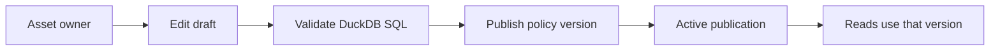
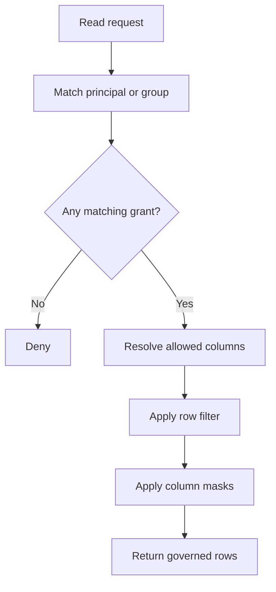

# Policy Authoring

Policies describe who can read an asset and how data is shaped before it is
returned. Asset owners use the control-plane UI to edit owners, rules, row
filters, masks, and policy versions.

## Policy Flow



Publishing is asset-scoped. Treat it as submitting a new version of one asset's
policy, not as a global release.

## Rule Evaluation



Allow rules can expose columns, add DuckDB row filters, and apply masks. Deny
rules deny matching projected columns for matching principals and conditions;
they do not carry row filters or masks.

## Authoring Checklist

- Start with the asset owner list. Only trusted owners should edit policies.
- Grant the smallest useful column set.
- Express row filters as DuckDB SQL boolean expressions.
- Express masks as DuckDB SQL expressions that preserve the intended type.
- Publish a policy version only after testing with representative users.

## Example Rule

```json
{
  "name": "us-analysts",
  "principals": ["group:us-analysts"],
  "columns": ["customer_id", "region", "revenue", "email"],
  "row_filter": "region = 'US'",
  "masks": {
    "email": "regexp_replace(email, '(^.).*(@.*$)', '\\1***\\2')"
  }
}
```

## Row Filters

Row filters must be DuckDB SQL expressions that evaluate to true or false.

Good examples:

```sql
region = 'US'
department in ('finance', 'risk')
revenue <= 100000
```

Avoid expressions that depend on non-deterministic behavior unless you have a
clear operational reason.

## Masks

Masks are DuckDB SQL expressions evaluated per row. Keep them simple and
obvious.

Examples:

```sql
'***'
regexp_replace(email, '(^.).*(@.*$)', '\\1***\\2')
case when region = 'EU' then null else phone end
```

## Testing A Policy

Test every policy with representative principals:

| Principal type | Expected check |
| --- | --- |
| Allowed reader | Receives only authorized columns and rows. |
| Privileged reader | Receives the intended unmasked columns. |
| Denied reader | Receives an authorization failure. |
| Asset owner | Can edit owners, filters, masks, and policy versions. |

Local reference environments can script these checks, but the same pattern
applies to any deployment.

The control-plane API exposes the same server-side policy semantics for preview:

```http
POST /v1/assets/{asset_id}/policy-preview
```

The request supplies a principal, groups, and claims. The response reports the
allow/deny decision, visible columns, masks, row filter, and matched rule
ordinal without exposing tenant or cell internals.

For code changes to policy resolution, add focused tests under
`tests/domain/access_control/` and data-plane tests under `tests/interfaces/` or
`tests/infrastructure/` only when behavior changes there.
