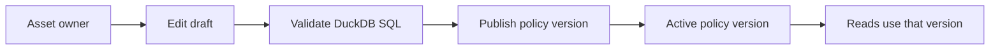
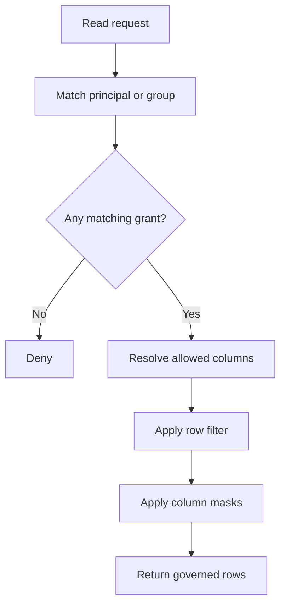

# Policy Authoring

Policies describe who can read an asset and how data is shaped before it is
returned. Asset owners use the control-plane UI to edit owners, rules, row
filters, masks, and policy versions.

## Policy Flow


```mermaid
flowchart LR
    owner["Asset owner"] --> draft["Edit draft"]
    draft --> validate["Validate DuckDB SQL"]
    validate --> publish["Publish policy version"]
    publish --> active["Active policy version"]
    active --> read["Reads use that version"]
```

Publishing is asset-scoped. Treat it as submitting a new version of one asset's
policy, not as a global release.

The public control-plane model is workspace-first: assets, catalogs, owners,
policies, policy versions, and settings. Tenant, cell, and publication records
are internal runtime implementation details.

## Rule Evaluation


```mermaid
flowchart TD
    req["Read request"] --> principal["Match principal or group"]
    principal --> grant{"Any matching grant?"}
    grant -- "No" --> deny["Deny"]
    grant -- "Yes" --> columns["Resolve allowed columns"]
    columns --> filter["Apply row filter"]
    filter --> masks["Apply column masks"]
    masks --> result["Return governed rows"]
```

All columns are denied by default. A policy rule is an explicit grant: it can
expose columns, add row filters, and define masks. Multiple matching grants
combine by unioning columns, AND-combining row filters, and choosing the
strictest mask per column.

## Authoring Checklist

- Start with the asset owner list. Only trusted owners should edit policies.
- Grant the smallest useful column set.
- Express row filters as DuckDB SQL boolean expressions.
- Use one supported mask type per masked field.
- Publish a policy version only after testing with representative users.

## Example Rule

```json
{
  "name": "us-analysts",
  "principals": ["group:us-analysts"],
  "columns": ["customer_id", "region", "revenue", "email"],
  "row_filter": "region = 'US'",
  "masks": {
    "email": {"type": "email"},
    "customer_id": {"type": "hash"}
  }
}
```

## Row Filters

Row filters must be DuckDB SQL expressions that evaluate to true or false.

Good examples:

```sql
region = 'US'
department in ('finance', 'risk')
revenue <= 100000
```

Avoid expressions that depend on non-deterministic behavior unless you have a
clear operational reason.

## Masks

Masks are named operations evaluated by the DuckDB transform. The current mask
types are:

| Type | Value | Output |
| --- | --- | --- |
| `null` | none | typed `NULL` for the original field type |
| `redact` | replacement string, default `***` | string |
| `hash` | none | SHA-256 hex string |
| `default` | scalar literal | DuckDB-inferred literal type |
| `email` | none | partially redacted email string |
| `keep_last` | non-negative integer | string with only the last N characters visible |

Examples:

```json
{
  "email": {"type": "email"},
  "account_number": {"type": "keep_last", "value": 4},
  "notes": {"type": "redact", "value": "[redacted]"},
  "nickname": {"type": "null"}
}
```

## Testing A Policy

Test every policy with representative principals:

| Principal type | Expected check |
| --- | --- |
| Allowed reader | Receives only authorized columns and rows. |
| Privileged reader | Receives the intended unmasked columns. |
| Reader without a matching grant | Receives an authorization failure. |
| Asset owner | Can edit owners, filters, masks, and policy versions. |

Local reference environments can script these checks, but the same pattern
applies to any deployment.

The control-plane API exposes the same server-side policy semantics for preview:

```http
POST /v1/assets/{asset_id}/policy-preview
```

The request supplies a principal, groups, and claims. The response reports the
allow/deny decision, visible columns, masks, row filter, and matched rule
ordinal without exposing tenant or cell internals.

For code changes to policy resolution, add focused tests under
`tests/domain/access_control/` and data-plane tests under `tests/interfaces/` or
`tests/infrastructure/` only when behavior changes there.

Breaking changes for policy authors and API clients:

- Public tenant and cell endpoints were removed.
- Public publication endpoints were replaced by policy-version history.
