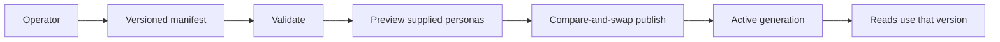
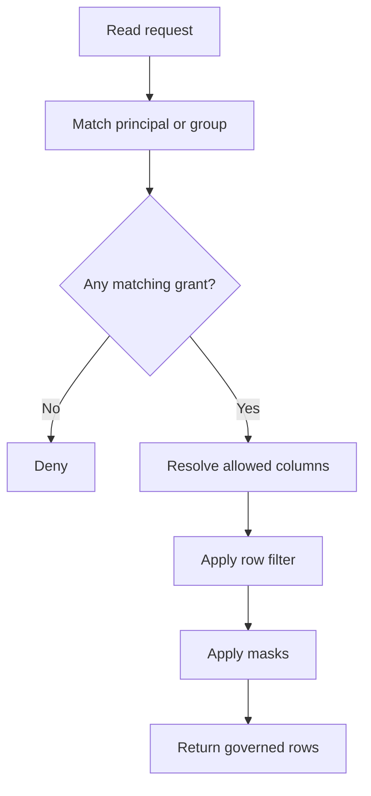

# Policy Authoring

Policies describe who can read an asset and how rows and columns are shaped
before data is returned. Operators author a versioned draft in the authenticated
governance UI, validate it, preview its effective grants against supplied
personas, send it through review, and publish it with a compare-and-swap
precondition. The administrative CLI remains available for offline validation,
migrations and recovery; it is not a second policy authority.

## Contents

- [Policy Flow](#policy-flow)
- [Rule Evaluation](#rule-evaluation)
- [Authoring Checklist](#authoring-checklist)
- [Example Rule](#example-rule)
- [Row Filters](#row-filters)
- [Masks](#masks)
- [Testing A Policy](#testing-a-policy)

## Policy Flow


```mermaid
flowchart LR
    operator["Operator"] --> manifest["Versioned manifest"]
    manifest --> validate["Validate"]
    validate --> preview["Preview supplied personas"]
    preview --> publish["Compare-and-swap publish"]
    publish --> active["Active generation"]
    active --> read["Reads use that version"]
```

Publishing creates one immutable generation for the selected runtime cell and
tenant. Preview input is an operator-supplied simulation; it is never reader
authentication.

## Rule Evaluation


```mermaid
flowchart TD
    req["Read request"] --> principal["Match principal or group"]
    principal --> grant{"Any matching grant?"}
    grant -- "No" --> deny["Deny"]
    grant -- "Yes" --> columns["Resolve allowed columns"]
    columns --> filter["Apply row filter"]
    filter --> masks["Apply masks"]
    masks --> result["Return governed rows"]
```

All columns are denied by default. A grant can expose columns, add a row filter,
and define masks. Multiple matching grants combine by:

- unioning visible columns,
- AND-combining row filters,
- applying only compatible masks; incompatible overlaps reject publication.

## Authoring Checklist

- Sign in through the control-plane UI with an operator account and confirm the
  selected asset and current revision before editing.
- Use the CLI only with operator credentials on an administrative host for
  offline validation, migrations or recovery procedures.
- Grant the smallest useful column set.
- Express row filters as DuckDB SQL boolean expressions.
- Use one supported mask type per masked field.
- Preview with representative, caller-supplied personas before publishing.
- Verify one allowed, one privileged, and one denied read persona.

## Example Rule

```json
{
  "name": "us-analysts",
  "principals": ["group:us-analysts"],
  "columns": ["customer_id", "region", "revenue", "email"],
  "row_filter": "region = 'US'",
  "masks": {
    "email": {"type": "email"},
    "customer_id": {"type": "hash"}
  }
}
```

## Row Filters

Row filters must be DuckDB SQL expressions that evaluate to true or false.

Good examples:

```sql
region = 'US'
department in ('finance', 'risk')
revenue <= 100000
```

Avoid expressions that depend on non-deterministic behavior unless you have a
clear operational reason.

Unsupported SQL is rejected before activation or planning. Keep row filters as
expressions, not statements.

## Masks

Masks are named operations evaluated by the DuckDB transform.

| Type | Value | Output |
| --- | --- | --- |
| `null` | none | typed `NULL` for the original field type |
| `redact` | replacement string, default `***` | string |
| `hash` | none | SHA-256 hex string |
| `default` | scalar literal | DuckDB-inferred literal type |
| `email` | none | partially redacted email string |
| `keep_last` | non-negative integer | string with only the last N characters visible |

Examples:

```json
{
  "email": {"type": "email"},
  "account_number": {"type": "keep_last", "value": 4},
  "notes": {"type": "redact", "value": "[redacted]"},
  "nickname": {"type": "null"}
}
```

## Testing A Policy

Test every policy with representative principals:

| Principal type | Expected check |
| --- | --- |
| Allowed reader | Receives only authorized columns and rows. |
| Privileged reader | Receives intended unmasked columns. |
| Reader without a matching grant | Receives an authorization failure. |
| Operator | Validates and publishes the manifest after preview. |

Use the UI's **Test policy** action for the normal review workflow. For an
offline, caller-supplied preview, run
`dal-obscura-admin preview manifest.json --personas personas.json`. It never
authenticates a persona or substitutes for a real gateway authorization
decision. Publishing requires the server-side review and revision checks in
either path.

For code changes to policy resolution, add focused tests under
`tests/domain/access_control/` and data-plane tests under `tests/interfaces/` or
`tests/infrastructure/` only when behavior changes there.
