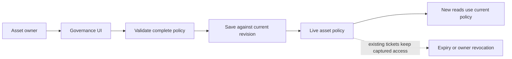

# Policy Authoring

Policies describe who can read an asset and how rows and columns are shaped
before data is returned. An authorized asset owner edits the live policy in the
authenticated governance UI. The control plane validates and saves the whole
policy against its current revision in one request; a stale edit fails with a
conflict and must be reloaded before retrying. There is no policy draft, review,
publication, or bundle workflow.

## Contents

- [Direct Policy Editing](#direct-policy-editing)
- [Rule Evaluation](#rule-evaluation)
- [Authoring Checklist](#authoring-checklist)
- [Example Rule](#example-rule)
- [Row Filters](#row-filters)
- [Masks](#masks)
- [Testing A Policy](#testing-a-policy)

## Direct Policy Editing


```mermaid
flowchart LR
    owner["Asset owner"] --> editor["Governance UI"]
    editor --> validate["Validate complete policy"]
    validate --> save["Save against current revision"]
    save --> live["Live asset policy"]
    live --> read["New reads use current policy"]
    live -. existing tickets keep captured access .-> expiry["Expiry or owner revocation"]
```

Policy saves take effect for new reads immediately. Existing tickets keep their
captured permissions until expiry by default. Asset owners can select **Revoke
existing tokens after saving** or use **Revoke all active tokens** in the
asset's Access view when a change must take effect immediately.

The continuous rule editor uses **Apply** for one local mask change and
**Save policy** for the complete live policy. Save checks the current revision;
a conflict requires reloading before retrying. **Test saved policy** always
evaluates the saved live policy, including while local edits remain unsaved.
Testing uses supplied principal, group, and claim values. It is a simulation,
never reader authentication or a substitute for a real authorized Flight read.

## Rule Evaluation

Every requested column starts with a typed `NULL` mask. A matching rule's
`columns` override that baseline: an entry without an explicit mask reveals the
original value; an entry with a mask applies that mask. Unmatched readers receive
NULL values, not an authorization failure. Authentication and asset
resolution remain required. An ungoverned target is still rejected.

The baseline is distinct from an **explicit** `null` mask. Matching rules combine
without order or first-match precedence:

- Column grants union; a grant overrides the baseline NULL for that column.
- An explicit mask beats a no-mask grant from another matching rule.
- Explicit `null` wins over other masks. Identical masks merge; `keep_last`
  uses the smaller count. Other incompatible combinations reject the read.
  Saving does not prove that all possible identity combinations are conflict-free;
  test representative personas before relying on a policy.
- All matching row filters combine with AND, including rules with no selected
  columns. An unfiltered rule does not cancel another rule's restriction.
- Mask exemptions skip only that rule's mask; another matching rule can still
  mask the column. Exemptions do not bypass row filters.

For example, two rules for `group:analysts` with `email: hash` and no mask still
hash email. `hash` plus explicit `null` returns NULL. `email` plus `keep_last`
rejects that read. Filters `country = 'US'` and `country = 'CA'` return no rows;
use a single OR filter when either region should be allowed.

**Allow all to all users** adds an explicit `allow_all` rule. After saving, this
short-circuits every mask and row filter for every authenticated reader, including
future columns. Delete that rule and save to restore the other rules. Ordinary
`*` audience grants do not have this bypass behavior.

## Authoring Checklist

Start in **Assets**, the searchable inventory. Open an asset to enter its dedicated
workspace with Policy, Access, and Consumers tabs. The inventory is not shown
inside the editor. **Back to assets**, the Assets breadcrumb, and primary
navigation return to the inventory while retaining the current search in this
session. Asset URLs support direct links and browser Back/Forward navigation;
leaving unfinished edits requires confirmation.

Unsaved-navigation, reload, token-revocation, and configuration confirmations use
in-app dialogs with explicit action names. Cancel or Escape preserves the form
and returns focus to its trigger. Routine navigation without unsaved changes
does not require confirmation. Token revocation shows an in-progress state and
blocks duplicate submissions until the request finishes.

Policy testing validates the principal and claims JSON before sending a request.
Progress and errors appear inside the test modal. Changing a persona clears its
previous result; responses for an older persona cannot replace the current one.
The result counts evaluated fields, including fields that remain NULL-masked.

The policy API rejects invalid rules with HTTP 422 and the existing correlated
`error.field_errors` envelope. Each semantic error identifies its zero-based rule
path (for example, `rules.1`); the UI presents this as **Rule 2** and opens that
rule. Unsupported effects are rejected at `rules.N.effect`; supported effects are
`allow` and `allow_all`. The evaluator always tests all schema fields, so its
request accepts `principal`, `groups`, `claims`, and optional `rows`. The unused
`columns` parameter is removed and rejected. Blank principals or groups are
invalid, and surrounding whitespace is trimmed. Omitted rows use synthetic data;
an explicit empty list still evaluates zero rows.

1. Give each rule a name and optional description, then choose its people/groups
   and optional identity claim conditions. Rules stack vertically and collapse
   independently; collapsing preserves unfinished edits.
2. Select allowed columns. These show original values until a mask is applied.
   **Select all**, **Select all except…**, and **Add by prefix** expand to current
   schema leaves. Excluding a parent excludes its entire subtree. These shortcuts
   freeze the current selection; they do not automatically grant future fields.
3. Optionally click **Add Column Masks**, select a mask and target columns, then
   add column or people/group exemptions. **No mask** removes explicit masking
   for those columns in this rule. **Apply mask** updates local edits.
4. Optionally click **Add Row Filter**. The builder handles All/Any conditions;
   DuckDB SQL handles advanced predicates. A row-only rule may select no columns.
5. Apply or cancel open mask/filter forms, then **Save policy**. **Discard all
   changes** restores the last successfully saved policy, including unapplied
   forms. There is no Undo/Redo policy history.
6. Use **Test Policy** or **Test saved policy** to open the same modal. Principal,
   groups, and claims persist between openings. Tests always use the saved
   policy; unsaved edits are not evaluated. Verify actual Flight reads separately.
7. Choose whether saving should revoke existing asset tickets. Without revocation,
   existing tickets retain their captured permissions until expiry.

Nested structs, list elements (`$element`), and map values (`$value`) use the same
leaf semantics. Selecting a parent expands its descendants when saved. Nonselected
siblings remain NULL. Map keys (`$key`) must also be allowed to expose the map:
Arrow maps cannot contain NULL keys, so a NULL-masked key makes the entire map
NULL. Mask map values for selective disclosure.

The demo fixture includes five-level struct paths and nested structs inside
lists and maps. The seed script preserves existing tables; use a fresh demo
warehouse to load the extended schema.

## Example Rule

```json
{
  "name": "us-analysts",
  "principals": ["group:us-analysts"],
  "columns": ["customer_id", "region", "revenue", "email"],
  "row_filter": "region = 'US'",
  "masks": {
    "email": {"type": "email"},
    "customer_id": {"type": "hash"}
  }
}
```

## Row Filters

Row filters must be DuckDB SQL predicates that evaluate to true or false. The
Builder supports a flat group of All conditions (AND) or Any condition (OR),
typed values, `IN`, and explicit NULL checks. Use DuckDB SQL mode for nested
groups, collection paths, and other advanced expressions. Existing SQL opens
unchanged in SQL mode.

Choose **Add Row Filter** to start a condition, then add more conditions if needed.
**Apply row filter** keeps the builder open for further edits. **All rows** removes
this rule's filter; it does not override filters from other matching rules.
Switching from Builder to SQL copies the generated expression. Replacing
existing SQL with the Builder requires an explicit **Replace with builder**
action so advanced expressions cannot be silently lost.

Every matching rule's filter applies to the whole result and filters combine
with AND. Filters run against original source values before masks. A filter
field can be omitted from the returned columns. A NULL predicate does not pass
a WHERE filter; use `IS NULL` or `IS NOT NULL` to test NULL explicitly.

Examples:

1. An analyst rule filters `country = 'US'`, hashes email, and exempts
   `group:privacy-reviewers`. A reader in both groups sees original email for
   US rows only.
2. If another matching rule filters `active = true`, the effective filter is
   `(country = 'US') AND (active = true)`.
3. Matching filters `country = 'US'` and `country = 'CA'` produce no rows. The
   authorization decision can still be allowed.
4. To allow either US or CA, use one rule with Any conditions, producing
   `(country = 'US') OR (country = 'CA')`. Two overlapping rules are not an
   equivalent configuration.
5. A broad unfiltered grant does not override another matching restrictive
   filter. Overlapping identity groups can make both rules apply.

Mask exemptions skip only a mask contribution. They do not bypass the rule's
grant or row filter. A second matching rule can still mask the same column.
Column exemptions and people/group exemptions are local to one rule.

Good examples:

```sql
region = 'US'
department in ('finance', 'risk')
revenue <= 100000
```

Avoid expressions that depend on non-deterministic behavior unless you have a
clear operational reason.

Unsupported SQL is rejected before the live policy changes. Keep row filters as
expressions, not statements.

## Masks

Masks are named operations evaluated by the DuckDB transform.

| Type | Value | Output |
| --- | --- | --- |
| `null` | none | typed `NULL` for the original field type |
| `redact` | replacement string, default `***` | string |
| `hash` | none | SHA-256 hex string |
| `default` | scalar literal | DuckDB-inferred literal type |
| `email` | none | partially redacted email string |
| `keep_last` | non-negative integer | string with only the last N characters visible |

Examples:

```json
{
  "email": {"type": "email"},
  "account_number": {"type": "keep_last", "value": 4},
  "notes": {"type": "redact", "value": "[redacted]"},
  "nickname": {"type": "null"}
}
```

Add `exempt_principals` inside a mask to let matching principal tokens skip
that mask in this rule. Tokens are literal principal IDs (for example,
`user:alice`) or group tokens (for example, `group:privacy-reviewers`). They do
not grant access, remove row restrictions, or cancel masks from other rules.

```json
{
  "email": {
    "type": "hash",
    "exempt_principals": ["group:privacy-reviewers", "user:alice"]
  }
}
```

## Testing A Policy

Test every policy with representative principals:

| Principal type | Expected check |
| --- | --- |
| Allowed reader | Receives requested columns with intended NULL/mask overrides and filtered rows. |
| Privileged reader | Receives intended unmasked columns. |
| Reader without a matching grant | Receives NULL values for all requested fields. |
| Asset owner | Can edit the policy and decide whether to revoke existing tickets. |

Use the UI's **Test saved policy** action to evaluate a saved live policy for a
synthetic persona. Verify granted and unmatched-reader Flight reads separately;
synthetic evaluation never authenticates a persona or substitutes for a real
gateway authorization decision.

For code changes to policy resolution, add focused tests under
`tests/domain/access_control/` and data-plane tests under `tests/interfaces/` or
`tests/infrastructure/` only when behavior changes there.

Mask paths are expanded against the admitted schema when saving. Overlapping
parent/child selections may repeat the same normalized mask, but different masks
(including different exemptions) on the same expanded field are rejected rather
than depending on JSON key order. Choose one mask per field within a rule; conflict
resolution across matching rules remains restrictive as described above.
`null`, `hash`, and `email` do not accept replacement values. Invalid mask parameters
are rejected consistently by authoring, schema calculation, and execution.
