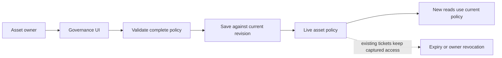
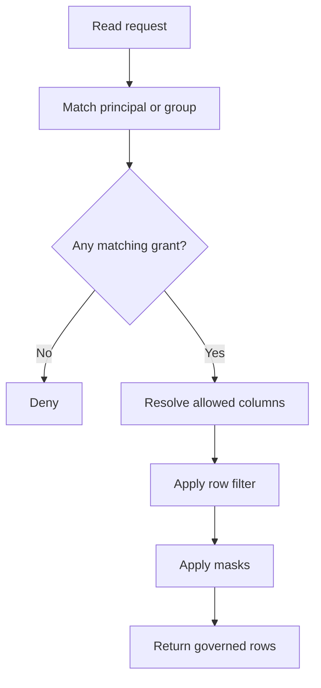

# Policy Authoring

Policies describe who can read an asset and how rows and columns are shaped
before data is returned. An authorized asset owner edits the live policy in the
authenticated governance UI. The control plane validates and saves the whole
policy against its current revision in one request; a stale edit fails with a
conflict and must be reloaded before retrying. There is no policy draft, review,
publication, or bundle workflow.

## Contents

- [Direct Policy Editing](#direct-policy-editing)
- [Rule Evaluation](#rule-evaluation)
- [Authoring Checklist](#authoring-checklist)
- [Example Rule](#example-rule)
- [Row Filters](#row-filters)
- [Masks](#masks)
- [Testing A Policy](#testing-a-policy)

## Direct Policy Editing


```mermaid
flowchart LR
    owner["Asset owner"] --> editor["Governance UI"]
    editor --> validate["Validate complete policy"]
    validate --> save["Save against current revision"]
    save --> live["Live asset policy"]
    live --> read["New reads use current policy"]
    live -. existing tickets keep captured access .-> expiry["Expiry or owner revocation"]
```

Policy saves take effect for new reads immediately. Existing tickets keep their
captured permissions until expiry by default. Asset owners can select **Revoke
existing tokens after saving** or use **Revoke all active tokens** in the
asset's Access view when a change must take effect immediately.

Policy testing uses supplied principal, group, and claim values to evaluate the
current saved policy. It is a simulation, never reader authentication or a
substitute for a real authorized Flight read.

## Rule Evaluation


```mermaid
flowchart TD
    req["Read request"] --> principal["Match principal or group"]
    principal --> grant{"Any matching grant?"}
    grant -- "No" --> deny["Deny"]
    grant -- "Yes" --> columns["Resolve allowed columns"]
    columns --> filter["Apply row filter"]
    filter --> masks["Apply masks"]
    masks --> result["Return governed rows"]
```

All columns are denied by default. A grant can expose columns, add a row filter,
and define masks. Multiple matching grants combine by:

- unioning visible columns,
- AND-combining row filters,
- applying only compatible masks; incompatible overlaps reject the save.

## Authoring Checklist

- Sign in through the control-plane UI with an operator account and confirm the
  selected asset and current revision before editing.
- Use the CLI only with operator credentials on an administrative host for
  offline validation, migrations or recovery procedures.
- Grant the smallest useful column set.
- Express row filters as DuckDB SQL boolean expressions.
- Use one supported mask type per masked field.
- Save the complete change and run a policy test with representative,
  caller-supplied personas.
- Choose whether existing asset tickets should be revoked by this save.
- Verify one allowed, one privileged, and one denied read persona.

## Example Rule

```json
{
  "name": "us-analysts",
  "principals": ["group:us-analysts"],
  "columns": ["customer_id", "region", "revenue", "email"],
  "row_filter": "region = 'US'",
  "masks": {
    "email": {"type": "email"},
    "customer_id": {"type": "hash"}
  }
}
```

## Row Filters

Row filters must be DuckDB SQL expressions that evaluate to true or false.

Good examples:

```sql
region = 'US'
department in ('finance', 'risk')
revenue <= 100000
```

Avoid expressions that depend on non-deterministic behavior unless you have a
clear operational reason.

Unsupported SQL is rejected before the live policy changes. Keep row filters as
expressions, not statements.

## Masks

Masks are named operations evaluated by the DuckDB transform.

| Type | Value | Output |
| --- | --- | --- |
| `null` | none | typed `NULL` for the original field type |
| `redact` | replacement string, default `***` | string |
| `hash` | none | SHA-256 hex string |
| `default` | scalar literal | DuckDB-inferred literal type |
| `email` | none | partially redacted email string |
| `keep_last` | non-negative integer | string with only the last N characters visible |

Examples:

```json
{
  "email": {"type": "email"},
  "account_number": {"type": "keep_last", "value": 4},
  "notes": {"type": "redact", "value": "[redacted]"},
  "nickname": {"type": "null"}
}
```

## Testing A Policy

Test every policy with representative principals:

| Principal type | Expected check |
| --- | --- |
| Allowed reader | Receives only authorized columns and rows. |
| Privileged reader | Receives intended unmasked columns. |
| Reader without a matching grant | Receives an authorization failure. |
| Asset owner | Can edit the policy and decide whether to revoke existing tickets. |

Use the UI's **Run policy test** action to evaluate a saved live policy for a
synthetic persona. Verify one allowed and one denied Flight read separately;
synthetic evaluation never authenticates a persona or substitutes for a real
gateway authorization decision.

For code changes to policy resolution, add focused tests under
`tests/domain/access_control/` and data-plane tests under `tests/interfaces/` or
`tests/infrastructure/` only when behavior changes there.
