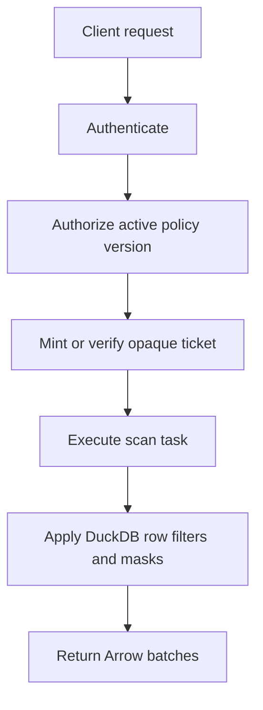
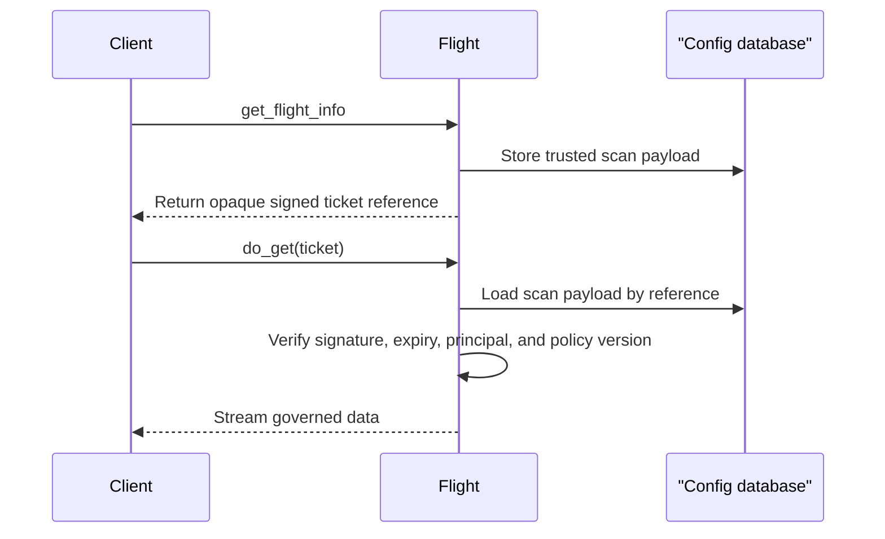
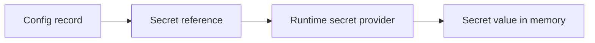

# Security Guide

dal-obscura is designed to authenticate every read, authorize against the active
policy version, and enforce row filters and masks inside the data plane.

## Security Model

## Identity Providers

The service supports multiple identity adapters. Choose the narrowest provider
that fits the deployment.

| Provider | Best for | Notes |
| --- | --- | --- |
| OIDC/JWKS | Browser UI, Keycloak, enterprise IdPs | Recommended default. |
| API key | Local development or service accounts | Keep keys in secret storage. |
| mTLS | Service-to-service reads | Use certificate identity mapping. |
| Trusted headers | Reverse proxies | Only use when the proxy boundary is locked down. |
| Composite | Mixed environments | Make provider order explicit. |

Auth examples live under [`examples/auth`](../examples/auth).

## Ticket Lifecycle

Tickets are opaque and signed. The client does not get to replay or edit scan
payloads. The data plane verifies ticket expiry, principal, and active policy
version before streaming.

## Policy Enforcement

- Row filters and masks are DuckDB SQL expressions.
- Read requests are re-authenticated before data is streamed.
- Ticket content is treated as untrusted input until verified.
- Stale policy tickets are rejected rather than silently accepted.

## Secret Handling

Store secret references in configuration. Keep secret values in the environment,
container secret store, or another runtime secret provider.

## Browser UI

For interactive users, prefer OIDC authorization-code flow with PKCE. The local
Keycloak example uses this pattern with a public browser client.

## Operator Checklist

- Use Postgres for persistent state.
- Use OIDC/JWKS unless another provider is required.
- Bind local examples to `127.0.0.1`.
- Rotate ticket and IAM secrets through the runtime secret provider.
- Test one allowed persona and one denied persona before exposing an environment.
- Do not expose trusted-header auth unless a trusted proxy controls the header.
