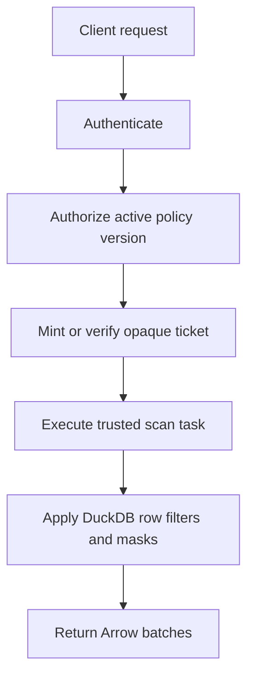
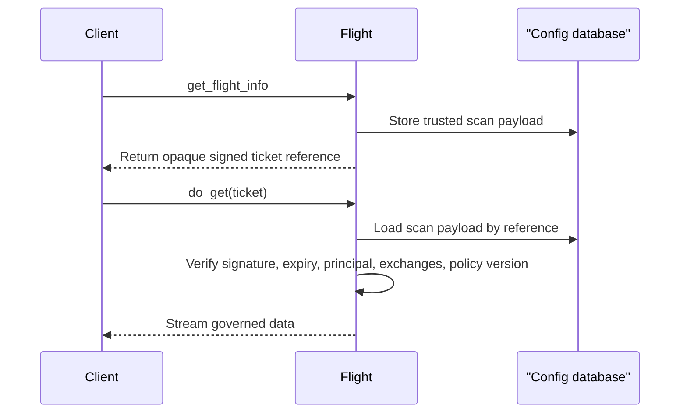
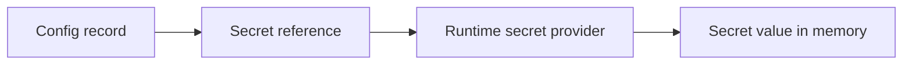

# Security Guide

dal-obscura authenticates every read, authorizes against the active asset policy
version, and enforces row filters and masks inside the data plane before Arrow
batches leave the service.

## Contents

- [Security Model](#security-model)
- [Trust Boundaries](#trust-boundaries)
- [Identity Providers](#identity-providers)
- [Ticket Lifecycle](#ticket-lifecycle)
- [Policy Enforcement](#policy-enforcement)
- [Secret Handling](#secret-handling)
- [Browser UI](#browser-ui)
- [Operator Checklist](#operator-checklist)

## Security Model

```mermaid
flowchart TD
    request["Client request"] --> auth["Authenticate"]
    auth --> policy["Authorize active policy version"]
    policy --> ticket["Mint or verify opaque ticket"]
    ticket --> execute["Execute trusted scan task"]
    execute --> transform["Apply DuckDB row filters and masks"]
    transform --> response["Return Arrow batches"]
```

The data plane re-authenticates on `do_get`; a ticket alone is not enough to
stream data.

## Trust Boundaries

| Boundary | Rule |
| --- | --- |
| Client request | Treat descriptor and ticket inputs as untrusted until parsed and verified. |
| Ticket payload | Client receives an opaque reference, not an editable scan plan. |
| Config database | Stores policy versions, active state, and trusted internal scan payloads. |
| Secret values | Stay in runtime secret providers, not in config records. |
| Trusted headers | Safe only behind a gateway that strips client-supplied identity headers. |

Tickets persist trusted internal Python scan tasks server-side. That DB payload
is an internal boundary and is not a public connector contract.

## Identity Providers

Choose the narrowest provider that fits the deployment.

| Provider | Best for | Notes |
| --- | --- | --- |
| OIDC/JWKS | Browser UI, Keycloak, enterprise IdPs | Recommended default. |
| API key | Local development or service accounts | Keep keys in secret storage. |
| mTLS | Service-to-service reads | Use certificate identity mapping. |
| Trusted headers | Reverse proxies | Only use behind a locked-down proxy boundary. |
| Composite | Mixed environments | Make provider order explicit. |

Runnable auth examples live under [`examples/auth`](../examples/auth).

## Ticket Lifecycle

```mermaid
sequenceDiagram
    participant Client
    participant Flight
    participant Store as "Config database"

    Client->>Flight: get_flight_info
    Flight->>Store: Store trusted scan payload
    Flight-->>Client: Return opaque signed ticket reference
    Client->>Flight: do_get(ticket)
    Flight->>Store: Load scan payload by reference
    Flight->>Flight: Verify signature, expiry, principal, exchanges, policy version
    Flight-->>Client: Stream governed data
```

The data plane verifies ticket expiry, principal, exchange count, and active
policy version before streaming. Stale policy tickets are rejected rather than
silently accepted.

## Policy Enforcement

- Default behavior is deny.
- Row filters and masks are DuckDB SQL expressions.
- Engine-provided row filters are validated before planning.
- Backend pushdown is an optimization; the data plane reapplies the effective
  filter during fetch when needed.
- Masking changes must update both DuckDB projection logic and masked schema
  behavior.

## Secret Handling

```mermaid
flowchart LR
    config["Config record"] --> ref["Secret reference"]
    ref --> provider["Runtime secret provider"]
    provider --> value["Secret value in memory"]
```

Store references in configuration. Keep secret values in environment variables,
container secret stores, or another runtime secret provider.

## Browser UI

For interactive users, prefer OIDC authorization-code flow with PKCE. The local
Keycloak demo uses this pattern with a public browser client.

The standalone UI should be exposed with the same IAM posture as the API. Do
not render bootstrap admin tokens into UI HTML or static config.

## Operator Checklist

- Use Postgres for persistent shared state.
- Use OIDC/JWKS unless another provider is required.
- Bind local examples to `127.0.0.1`.
- Rotate ticket and IAM secrets through the runtime secret provider.
- Test one allowed persona and one denied persona before exposing an
  environment.
- Do not expose trusted-header auth unless a trusted proxy controls the header.
