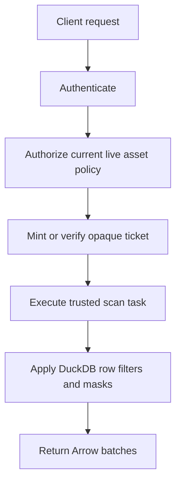
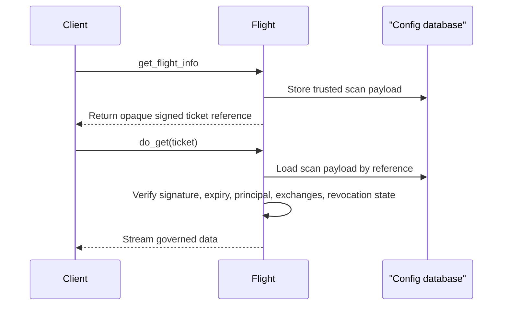
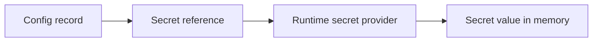

# Security Guide

dal-obscura authenticates every read and enforces row filters and masks inside
the data plane before Arrow batches leave the service. Asset policy edits write
directly to live configuration. Tickets issued before an edit retain the
permissions captured at planning until expiry unless the asset owner revokes
them.

## Contents

- [Security Model](#security-model)
- [Trust Boundaries](#trust-boundaries)
- [Identity Providers](#identity-providers)
- [Ticket Lifecycle](#ticket-lifecycle)
- [Policy Enforcement](#policy-enforcement)
- [Secret Handling](#secret-handling)
- [Live Configuration And Ticket Revocation](#live-configuration-and-ticket-revocation)
- [Operator Checklist](#operator-checklist)

## Security Model

```mermaid
flowchart TD
    request["Client request"] --> auth["Authenticate"]
    auth --> policy["Authorize current live asset policy"]
    policy --> ticket["Mint or verify opaque ticket"]
    ticket --> execute["Execute trusted scan task"]
    execute --> transform["Apply DuckDB row filters and masks"]
    transform --> response["Return Arrow batches"]
```

The data plane re-authenticates on `do_get`; a ticket alone is not enough to
stream data.

## Trust Boundaries

| Boundary | Rule |
| --- | --- |
| Client request | Treat descriptor and ticket inputs as untrusted until parsed and verified. |
| Ticket payload | Client receives an opaque reference, not an editable scan plan. |
| Config database | Stores live policy revisions and trusted internal scan payloads. |
| Secret values | Stay in runtime secret providers, not in config records. |

Tickets persist trusted internal Python scan tasks server-side. That DB payload
is an internal boundary and is not a public connector contract.

## Identity Providers

| Provider | Best for | Notes |
| --- | --- | --- |
| OIDC/JWKS | Gateway and local Keycloak demos | Required identity provider. |

The gateway accepts one configured OIDC/JWKS provider. API keys, trusted headers,
mTLS identity mapping, shared-secret JWTs, and composite auth are unsupported.
Remote JWKS refreshes are rate-limited (30 seconds by default) and accept at
most 256 usable signing keys. A newly rotated key becomes usable after that
interval; unknown key IDs fail closed without causing one network request per
authentication attempt. Operators can tighten both limits in the provider
configuration when their IdP rotation policy requires it.

Browser sign-out revokes the local session and expires both session and CSRF
cookies before navigating to the provider's RP-initiated logout endpoint. The
request carries the configured client ID and registered post-logout return URI;
provider tokens are not retained or sent to the browser. Without an ID-token
hint, the provider can require confirmation before ending its SSO session.
Deployments using a non-Keycloak provider should set
`DAL_OBSCURA_CONTROL_PLANE_UI_OIDC_END_SESSION_ENDPOINT` to its logout endpoint.
The return URI must match the UI origin and be registered with the provider.

## Ticket Lifecycle

```mermaid
sequenceDiagram
    participant Client
    participant Flight
    participant Store as "Config database"

    Client->>Flight: get_flight_info
    Flight->>Store: Store trusted scan payload
    Flight-->>Client: Return opaque signed ticket reference
    Client->>Flight: do_get(ticket)
    Flight->>Store: Load scan payload by reference
    Flight->>Flight: Verify signature, expiry, principal, exchanges, revocation state
    Flight-->>Client: Stream governed data
```

The data plane verifies ticket expiry, principal, exchange count, and explicit
revocation state before streaming. It does not silently rewrite a ticket's
captured permissions after a policy edit.

## Policy Enforcement

- Default behavior is deny.
- Row filters and masks are DuckDB SQL expressions.
- Engine-provided row filters are validated before planning.
- Backend pushdown is an optimization; the data plane reapplies the effective
  filter during fetch when needed.
- Masking changes must update both DuckDB projection logic and masked schema
  behavior.

## Secret Handling

```mermaid
flowchart LR
    config["Config record"] --> ref["Secret reference"]
    ref --> provider["Runtime secret provider"]
    provider --> value["Secret value in memory"]
```

Store references in configuration. Keep secret values in environment variables,
container secret stores, or another runtime secret provider.

The supported environment provider accepts a `scope_grants` object in
`DAL_OBSCURA_SECRET_PROVIDER_CONFIG`. Each exact caller scope (for example,
`catalog:analytics` or `identity`) must name the secret keys it may resolve.
Secret resolution is denied unless the provider implements scope authorization
and this grant map includes the exact scope and key; a matching reference scope
alone cannot authorize an environment lookup. Production startup requires a
non-empty grant map in both planes.

## Live Configuration And Ticket Revocation

An authorized owner saves a policy directly to its asset using the current
`policy_revision`. The control plane validates the complete replacement and
updates it transactionally; stale revisions fail with a conflict. There is no
workspace bundle or separate review/publish stage.

Existing tickets retain their original authorized columns, row filter, and
masks until their normal expiry. This supports predictable in-flight access
through routine policy edits, but owners must revoke tickets when a change must
take effect immediately. The asset Access view can revoke every active ticket,
and the policy editor offers the same revocation as part of a save. The API
records the operation and returns the number of tickets revoked.

Treat ticket revocation as an access-control action: it can interrupt readers
using the asset. Use the explicit owner action for urgent invalidation; for a
routine policy change, leave revocation off unless the existing authorization
must stop immediately.

## Operator Checklist

- Use Postgres for persistent shared state.
- Use the supported OIDC/JWKS provider.
- Bind local examples to `127.0.0.1`.
- Rotate ticket and IAM secrets through the runtime secret provider.
- Decide whether each policy edit must revoke existing asset tickets; otherwise
  they remain usable until expiry.
- Test one allowed persona and one denied persona before exposing an
  environment.
