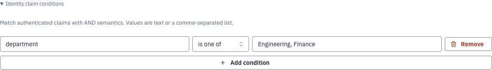
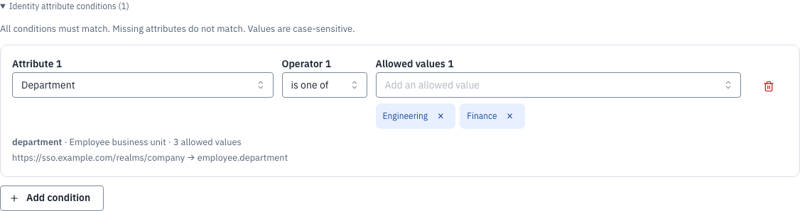
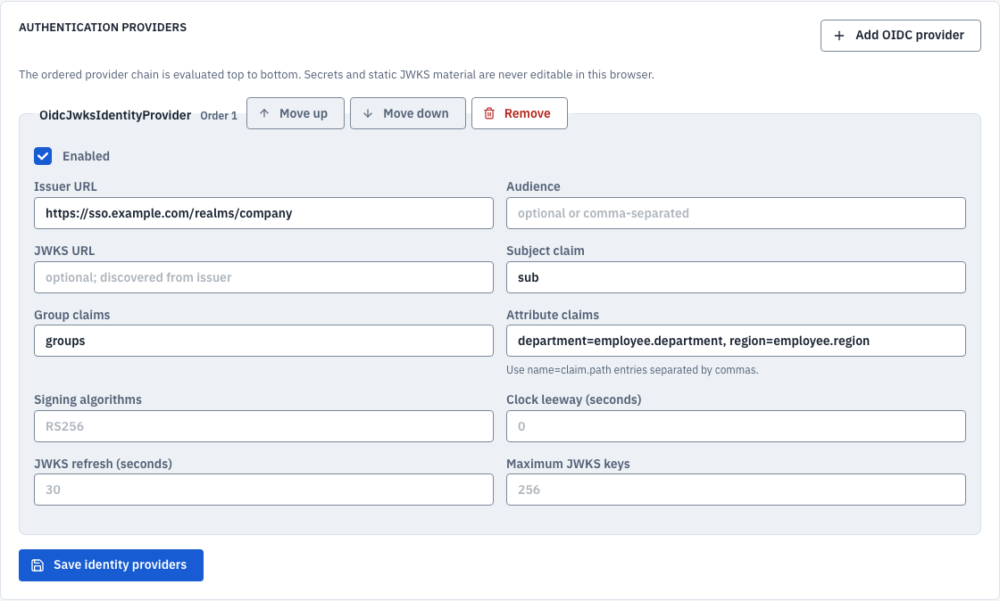
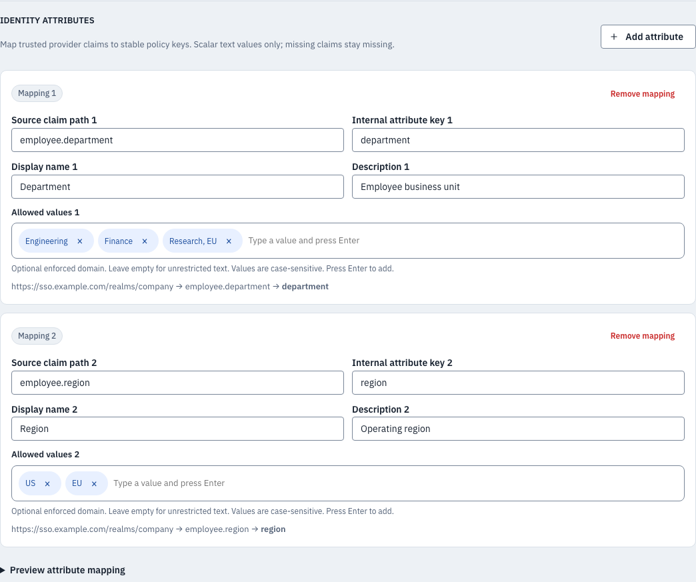
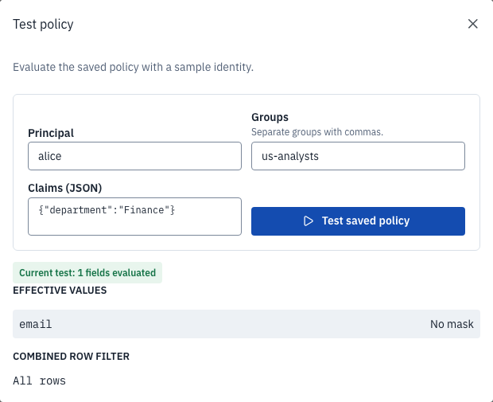
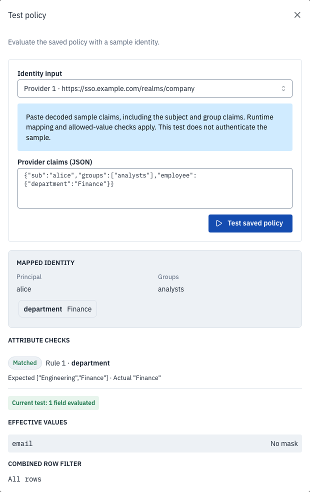

# Identity attribute authoring: before and after

Screenshots show the actual previous UI at commit `37fb407c` and the updated UI,
with identical synthetic provider and policy fixtures. Browser fixtures illustrate
composition, not live SSO. Backend tests separately verify signed JWT mapping,
allowed-value enforcement, asset access controls, and source-free previews.

## Policy conditions

Before: raw key and comma-separated value inputs. Authors had to know the exact
claim names and values, and a comma inside one value was ambiguous.

After: searchable mapped attributes, searchable allowed values, removable value
chips, source issuer/path, domain size, and clear AND/missing-attribute semantics.
Changing attributes clears prior values. Unknown existing keys and removed values
remain visible with warnings; incomplete and duplicate conditions block saving.

Why: make policy facts discoverable, preserve exact values, and prevent accidental
reuse of a value from a different attribute.

## Identity mappings

Before: `name=claim.path` entries in one text field, with no descriptive schema or
value domain.

After: separate mapping cards for source path, internal key, display name,
description, and optional allowed values. An unsaved mapping preview uses the
runtime mapper against a synthetic decoded payload, including missing-claim
feedback. It neither saves configuration nor contacts an identity provider.

Why: explicit mapping makes the source-to-policy relationship reviewable.
Configured allowed values are enforced domains, not values inferred from whoever
has logged in. Empty domains permit unrestricted scalar text.

## Policy testing

Before: synthetic principal/groups and free-form claims, followed by effective
columns and row filter. Nested objects were stringified rather than mapped.

After: explicit internal-attribute or provider-claim mode. Provider mode maps the
subject, groups, and attributes through the same mapper used for verified runtime
JWTs. The result shows normalized identity and each attribute condition's expected
and actual value, with matched/missing/not-matched states. Mode/input changes clear
stale results. Input and result sections use consistent full-width layout.

Why: distinguish testing policy logic from testing identity mappings, and show why
an attribute condition succeeds or fails. Synthetic tests do not authenticate a
user or validate a JWT; real runtime authentication still verifies the token.

## Scope and validation

Definitions use the existing authentication-provider JSON configuration. No new
persistent user directory, observed-value collection, or SCIM provisioning was
added. User attributes remain scalar; expected-value lists are policy alternatives.
Provider config changes require a data-plane worker restart, as before. Browser
SSO login configuration remains deployment-managed.

Tests cover enum enforcement with signed JWTs; missing and malformed claims;
metadata discovery authorization; unsaved preview without persistence; key changes;
comma-containing values; preserved unknown keys/removed values; stale results;
mobile accessibility; and existing access-management and session isolation flows.

To reproduce the screenshots, start a preview of the previous UI on port 4174,
then run `pnpm --dir apps/governance-ui capture:review identity-review.spec.ts`
against the current UI preview on port 4173. Screenshot capture has its own
Playwright configuration and is excluded from the correctness suite.
